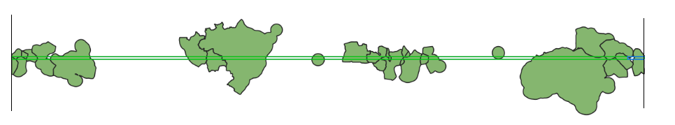

# Antimeridian

The [antimeridian](https://en.wikipedia.org/wiki/180th_meridian) is the 180 degree meridian.


With most GIS software, including SeaSketch, if you draw a polygon that has coordinates to the left and to the right of the antimeridian, you end up with coordinates that are outside of the established range of longitude from -180 to 180.

Example of Polygon extending off the "right" side of 180, going from 170 to 186.

```json
{
  "type": "Polygon",
  "coordinates": [
    [
      [170, -14],
      [186, -14],
      [186, -15],
      [170, -15],
      [170, -14]
    ]
  ]
}
```

Example of Polygon on the "left" side of the world, crossing over the antimeridian at -180 degrees longitude, going from -175 to -188.

```json
{
  "type": "Polygon",
  "coordinates": [
    [
      [-175, -16],
      [-188, -16],
      [-188, -15],
      [-175, -15],
      [-175, -16]
    ]
  ]
}
```

These polygons are technically valid, but spatial analysis libraries often don't deal well with this, producing errors or invalid output.

The solution, suggested by the [GeoJSON spec](https://datatracker.ietf.org/doc/html/rfc7946#section-3.1.9) is to split the polygons down the 180 meridian line, and shift the pieces that are outside the bounds of -180 to 180 back inside. For example:

- a longitude value of 200 (20 more than 180) will become -160 (20 more than -180)
- a longitude value of -200 (20 less than -180) will become 160 (20 less than 180)

## Splitting Sketches

The SeaSketch platform does not split sketches when you draw a Polygon. It is up to geoprocessing functions to split them before doing analysis. To do this, the [splitSketchAntimeridian](../api/geoprocessing/functions/splitSketchAntimeridian.md) and [splitFeatureAntimeridian](../api/geoprocessing/functions/splitFeatureAntimeridian.md) functions are available.

```typescript
import { splitSketchAntimeridian } from "@seasketch/geoprocessing";

const splitSketch = splitSketchAntimeridian(sketch);
```

The second polygon above, once split becomes:

```json
{
  "type": "MultiPolygon",
  "coordinates": [
    [
      [
        [-180, -14],
        [-174, -14],
        [-174, -15],
        [-180, -15],
        [-180, -14]
      ]
    ],
    [
      [
        [180, -15],
        [170, -15],
        [170, -14],
        [180, -14],
        [180, -15]
      ]
    ]
  ],
  "bbox": [-174, -15, 170, -14]
}
```


Notice that there are now 2 polygons, and that all of the coordinates are shifted to be within -180 to 180. Also notice that the `bbox` has shifted coordinates as well. This is important because the bounding box of a sketch is commonly used in analysis to efficiently fetch just the subset of features that overlap with a sketches bounding box, rather than fetching the whole datasource. See the [Splitting bounding boxes](#splitting-bounding-boxes) section below for more information.

It's also important to know that once split, the shifted pieces may appear as if they are on the other side of the world if you are viewing the data in software such as QGIS that displays data projected onto a rectangle that is split exactly at the 180th meridian.


References

- [https://macwright.com/2016/09/26/the-180th-meridian](https://macwright.com/2016/09/26/the-180th-meridian)

## Splitting Vector Datasources

Just like Sketches, `vector` datasources that you import and intend to use in preprocessing and geoprocessing functions also need to be split. Many global datasources such as OSM land, Marine Regions EEZ, etc. already are already split. Other vector datasources are not pre-split.

The `data:import` CLI command will automatically do this split using the ogr2ogr `wrapdateline` option.

## Splitting Raster Datasources

`Raster` datasources do not need to be split if they are within -180 to 180 degrees. For example if you have a raster for the entire country of Fiji, then when viewed in QGIS you should see data essentially on both sides of the world, with a big gap of data in between.


## Splitting Bounding Boxes

Bounding boxes need to be split before you can use them to fetch data from cloud-optimized spatial formats (Flatgeobuf, Cloud-optimized GeoTIFF).

### Fetching From Flatgeobuf

The `getFeaturesForSketchBBoxes` function automatically splits bounding boxes that cross the antimeridian.

The lower level `loadFgb` function, and underlying `flatgeobuf` library do not properly handle the antimeridian. If you call them with a bounding box that extends beyond the range of -180 to 180, they will return only the features that are within the range. If you shift the longitude values to be within the range, such as using the `cleanBBox` function, that will produce a bounding box that spans the globe (see screenshot below) and effectively `overfetch` more features than you wanted. This can work if your datasource is clipped to your study area, but will be very inefficient otherwise and should be avoided.



### Fetching From Cloud-Optimized GeoTIFF

If you will have Sketches/Features that cross the antimeridian, you should: split them first with `splitSketchAntimeridian`/`splitFeatureAntimeridian`, then call `rasterMetrics()` or any `geoblaze` stats function you need.

The bounding box of the split Sketch/Feature will span the world (see last section for image), but if your raster dataset is limited to your project area, then Geoblaze is smart enough to not try and fetch data outside the extent of the raster, or represent it in memory. So it is recommended to clip raster data to the project area if possible.

If your raster dataset extends across more of the globe longitudinally or the entire glove, then Geoglaze will overfetch data beyond the bounding box of your Sketch/Feature. This shouldn't affect your calculated results but it increases network and memory usage to fetch the extra data. If this is not acceptable, a user-space workaround might be for you to call your geoblaze calc methods for each half of your split Sketch/Feature, and then somehow merge the result.

## Putting It All Together

Here's an [example](https://github.com/underbluewaters/kiribati-reports/blob/5eb712f499a0fc799eb8372091808c49294154b9/src/functions/allenCoralAtlas.ts#L25) geoprocessing function that makes use of `splitSketchAntimeridian` and `getFeaturesForSketchBBoxes`.
