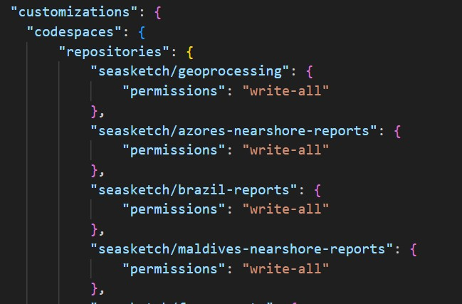

# Github Codespaces

- Github provides a server running Ubuntu Linux, pre-configured to develop your geoprocessing project. Your local VSCode editor connects to it.
- Best for: beginners trying things out, you don't need to use Docker Desktop on your system.
- Pros
  - Easiest to get started. The codespace is managed by Github and connection to VSCode running locally is seamless.
- Cons
  - limited to storing data directly in your repository.

## System Setup

Using Codespaces is a variation on using the Docker Desktop devcontainer setup (option 1) in the tutorial. You will init your project from within your codespace..

- You will need to create your own devcontainer repository in your own Github user account, or your own organization.
- Go to this [devcontainer repository](https://github.com/seasketch/geoprocessing-devcontainer-tpl).
- Click the green `Use this template` button and `Create a new repository`.

- You can call this repository `geoprocessing-devcontainer`. And if you create it under a Github organization, then everyone in the organization will be able to utilize it.

Now you're ready to setup codespaces for this devcontainer:

- Configure Github secrets for all environment variables your codespace will need for accessing POEditor and Amazon Web Services.
  - Go to your [Github codespace settings](https://github.com/settings/codespaces)
  - Define each of the following Codespaces secrets found in the screenshot.
  - your POEditor API token you can find here - https://poeditor.com/account/api. If you don't have one, then follow the instructions to [create your own](../gip/GIP-1-i18n.md)
  - You can leave your AWS credentials blank until you set them up in a later tutorial when you want to deploy your project.

- Browse to `https://github.com/seasketch/geoprocessing-devcontainer`
- Click the green `Code` button, then the `Codespaces` tab, then `New with options...`

- Accept all defaults, except choose a Machine type of `4-core` which provides the minimum 8GB of ram needed. See [Github codespace pricing](https://docs.github.com/en/billing/managing-billing-for-github-codespaces/about-billing-for-github-codespaces) for more information.

- It will automatically attempt to open your local VSCode editor and connect it to the codespace. You will be prompted to allow this to happen.

## Create new geoprocessing project

When developing within a codespace, you need to give it permission to read and write files from other repositories. You should have VSCode open and connected to your devcontainer codespace, with no outstanding uncommitted work. Then do the following:

- In VSCode, edit the .devcontainer/devcontainer.json and add your new geoprocessing project repository `[your_organization_or_username]/fsm-report-test` to the list. You will do this for each geoprocessing project you create and maintain in this devcontainer, which can be many.
- Commit and push these changes.

At this point, you need to close your VSCode codespace session and `delete` your existing codespace. Wait at least one minute for the codespace to be fully delete. Then recreate a new codespace and it will allow you to enable the new write permissions to your geoprocessing project repository. It's unfortunate that you need to delete your codespace and recreate it for you to be prompted to enable these permissions, hopefully it will be made simpler in the future. You can read more [here](https://docs.github.com/en/codespaces/managing-your-codespaces/managing-repository-access-for-your-codespaces#authorizing-requested-permissions)
