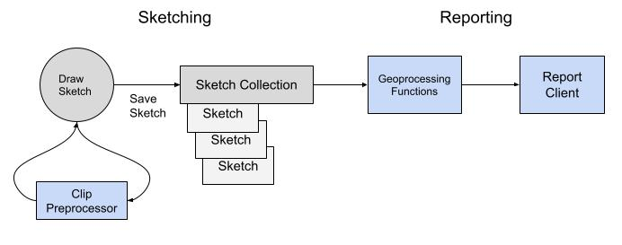

# Concepts

## Process

Geoprocessing projects built with this framework support step #2 and #4 in the following planning workflow, the [SeaSketch platform](https://docs.seasketch.org/seasketch-documentation) supports the rest. They work together to provide a complete solution.

1. Allow a user to draw a design (sketch) and define attributes (e.g. allowed activities, etc.).
2. **Preprocess that sketch to ensure it meets project guidelines, for example to ensure that it has a valid shape and is within the designated planning area.**
3. Allow a user to organize one or more sketches into a proposal (collection).
4. **Provide feedback (reports) on how well sketches and sketch collections meet measurable planning objectives and their targets (using geoprocessing functions).**
5. Allow users to share and iterate on designs as a group until they come to a decision.



### Terminology

There are a number of terms and concepts to be familiar with. Many of them are implemented as features of the framework.

<details>
<summary>General Terms</summary>

- `Goal` - also known as vision or aim. These are general summaries of the desired future state of an area.

  - Example - Protect biological diversity, productivity, and ecological function across all habitat types

- `Objective` - These are specific statements that describe how a planning goal will be reached and are typically measurable or quantifiable in some way.

  - Example - Designate a minimum of 20% of planning area as protected areas.

- `Target` - The measurement to reach to say that an objective has been met.

  - Example - 20% of the EEZ, 15% of a species habitat within planning area,

- `Metric` - an individual piece of data, a measurement. For example a spatial statistic or an area calculation.

- `Sketch` - a user-drawn feature, typically a Polygon, that can be shared, further altered or put into a Sketch Collection. A Sketch is an extension of a GeoJSON [Feature](https://www.rfc-editor.org/rfc/rfc7946#section-3.2).

- `Geography` - one or more geographic boundaries for the project. Primarily used to define project planning boundaries.

- `Datasource` - a published dataset within the project. It can be either Vector or Raster spatial data. A datasource can contain vector features that define the extent of a Geography or provide spatial data for calculating Metrics for sketches.

</details>

<details>
<summary>Marine Spatial Planning Terms</summary>

- `MPA` - marine protected area. An area designated for marine protection with defined allowed uses.

- `Territorial Sea` - A belt of coastal waters extending at most 12 nautical miles from the baseline (usually the mean low-water mark) of a coastal state.

- `EEZ` - exclusive economic zone aka "Offshore". An area of the sea in which a sovereign state has exclusive rights regarding the exploration and use of marine resources. It stretches from the outer edge of the territorial sea, 12 nautical miles out from the baseline, to 200 nautical miles. May also be defined as the "Offshore".

- `Nearshore` - a shorthand name used in marine planning projects, which often matches up with the definition of Territorial Sea, but it may not.

- `Offshore` - a shorthand name used in marine planning projects, which often matches up with the definition of EEZ, but it may not.

</details>

Here's a couple examples putting it all together:

- A polygon boundary Datasource containing a countries Exclusive Economic Zone is used to measure what % of the EEZ a proposed area covers.
- A coral reef Datasource can be used to measure whether a proposed area covers at least 50% of each coral type.
- A geomorphology Datasource can be used to measure whether a proposed area covers at least 20% of each seabottom type.

### Classification Systems

Planning processes may leverage a `classification system` for defining what levels of protection can be assigned to proposed areas. They then decide what protection levels are required at minimum to count towards meeting a planning objective. Marine Protected Areas or MPA's for example have multiple [classification schemes](https://docs.google.com/document/d/1i0baxgK8JEUjtU8mnzFiG5VB_gO8lmxCrAtJ5rltk30/edit?usp=sharing) to choose from.

## Sketching

The core SeaSketch platform allows users to create and collaborate on the design of areas to be managed or used in a specific way. Sketches are the main input to a geoprocessing project for processing and display of reports.

### Sketch

A [Sketch](https://seasketch.github.io/geoprocessing/api/interfaces/geoprocessing.Sketch.html) is a user-drawn feature, typically a Polygon, that can be shared, further altered or put into a Sketch Collection. A Sketch is an extension of a GeoJSON [Feature](https://www.rfc-editor.org/rfc/rfc7946#section-3.2).

[Sketch Properties](https://seasketch.github.io/geoprocessing/api/interfaces/geoprocessing.SketchProperties.html) are defined for both Sketches and SketchCollections and include key properties allowing sketches to be created and organized within a planning tool.

- `id` - the unique UUID of this sketch.
- `name` - the user-provided name
- `sketchClassId` - defines what type of sketch it is depending on the [classification system](https://docs.google.com/document/d/1i0baxgK8JEUjtU8mnzFiG5VB_gO8lmxCrAtJ5rltk30/edit?usp=sharing) used (e.g. Marine Reserve, Marine Sanctuary, High Protection MPA, Full Protection MPA).
- `userAttributes` - one or more attributes that the user can define on creation, for example a list of allowed activities in this area.
- `createdAt` - timestamp of original creation
- `updatedAt` - timestamp of last edit
- `isCollection` - whether or not the object is a sketch or a collection

An example of a Sketch is as follows:

```json
{
  "type": "Feature",
  "properties": {
    "name": "fsm-east-west",
    "updatedAt": "2022-11-17T10:02:53.645Z",
    "sketchClassId": "123abc",
    "id": "abc123"
  },
  "geometry": {
    "type": "Polygon",
    "coordinates": [
      [
        [149.3793667126688, 7.033915089905491],
        [167.1102326219892, 7.196404501212555],
        [167.0449537138265, 7.671995147373664],
        [149.3384476090506, 7.40755063883897],
        [149.3793667126688, 7.033915089905491]
      ]
    ]
  }
}
```

This is a sketch with unique ID `abc123` called `fsm-east-west` because it is a long thin polygon that stretches across the entire EEZ from east to west. You can paste this sketch snippet into [geojson.io](https://geojson.io) and view it.

### Sketch Collection

A [Sketch Collection](https://seasketch.github.io/geoprocessing/api/interfaces/geoprocessing.SketchCollection.html) is a collection of user-drawn Sketches. It can be used to represent a proposed group of areas. It is an extension of a GeoJSON [FeatureCollection](https://www.rfc-editor.org/rfc/rfc7946#section-3.3).

```json
{
  "id": 10924,
  "type": "FeatureCollection",
  "features": [
    {
      "id": 10923,
      "bbox": [137.42888, 8.6295395, 138.27959, 9.424693],
      "type": "Feature",
      "geometry": {
        "type": "Polygon",
        "coordinates": [
          [
            [137.428882987, 8.929802778],
            [137.778280122, 8.959815644],
            [138.127677257, 8.629539565],
            [138.279589055, 8.77970155],
            [137.89980956, 9.229818944],
            [137.550412426, 9.424693174],
            [137.428882987, 8.929802778]
          ]
        ]
      },
      "properties": {
        "id": "10923",
        "name": "small-west",
        "createdAt": "2023-01-10T17:20:17.178528+00:00",
        "updatedAt": "2023-01-10T17:20:36.678816+00:00",
        "isCollection": false,
        "sketchClassId": "104",
        "userAttributes": [
          {
            "label": "Author(s)",
            "value": "Tim Welch",
            "exportId": "authors",
            "fieldType": "TextArea"
          },
          {
            "label": "Description",
            "value": "Test sketch",
            "exportId": "descriptionconsider_adding_a_ra",
            "fieldType": "TextArea"
          }
        ]
      }
    }
  ],
  "properties": {
    "id": "10924",
    "name": "yes-contig-ssn",
    "createdAt": "2023-01-10T17:20:33.668529+00:00",
    "updatedAt": "2023-01-10T17:21:07.432889+00:00",
    "description": null,
    "isCollection": true,
    "sketchClassId": "119",
    "userAttributes": [
      {
        "label": "Description",
        "value": "Test collection",
        "exportId": "description",
        "fieldType": "TextArea"
      },
      {
        "label": "Author(s)",
        "value": "Tim Welch",
        "exportId": "authors",
        "fieldType": "TextArea"
      }
    ]
  }
}
```

## Geographies

`Geographies` identify polygon or multipolygon boundaries that serve specific purposes in your project. The main use case is to define planning boundaries for your project, if you have them.

Geographies are contained in `project/geographies.json`. The default Geography for a new project is the `world` geography. It uses the `world` datasource which is a polygon covering the entire extent of the world.

```json
{
  "geographyId": "world",
  "datasourceId": "world",
  "display": "World",
  "groups": ["default-boundary"],
  "precalc": true
}
```

Here is an example of a project with the `world` geography used as the outer boundary, and then 4 subregion geographies:

```json
[
  {
    "geographyId": "world",
    "datasourceId": "world",
    "display": "World",
    "groups": ["default-boundary"],
    "precalc": true
  },
  {
    "geographyId": "north_sr",
    "datasourceId": "north_sr",
    "display": "North Planning Region",
    "groups": [],
    "precalc": true
  },
  {
    "geographyId": "northcentral_sr",
    "datasourceId": "northcentral_sr",
    "display": "North Central Planning Region",
    "groups": [],
    "precalc": true
  },
  {
    "geographyId": "central_sr",
    "datasourceId": "central_sr",
    "display": "Central Planning Region",
    "groups": [],
    "precalc": true
  },
  {
    "geographyId": "south_sr",
    "datasourceId": "south_sr",
    "display": "South Planning Region",
    "groups": [],
    "precalc": true
  }
]
```

Here is an example of a more elaborate exclusive economic geography. Its boundary polygon(s) are uniquely identified within the larger global EEZ dataset using a `propertyFilter` and `bboxFilter`.

```json
{
    "geographyId": "world",
    "datasourceId": "world",
    "display": "World",
    "groups": [],
    "precalc": false
  },
  {
    "geographyId": "eez",
    "datasourceId": "global-eez-mr-v12",
    "display": "Samoan EEZ",
    "propertyFilter": {
      "property": "GEONAME",
      "values": [
        "Samoan Exclusive Economic Zone"
      ]
    },
    "bboxFilter": [
      -174.51139447157757,
      -15.878383591829206,
      -170.54265693017294,
      -10.960825304544073
    ],
    "groups": [
      "default-boundary"
    ],
    "precalc": true
  }
```

Once defined, geographies are used in the following ways:

- `Preprocessing functions` - a preprocessing function can clip a user-drawn sketch to one or more geographies so that they are guaranteed to be within it.
- `Precalc` - the precalc command calculates overall metrics (total area, count, sum of value) within each geography for each datasource. These precalc metrics are used to report a sketches % overlap with a datasource "per geography".
- `Geoprocessing functions` - geoprocessing functions can perform spatial analysis and report results "per geography" by clipping a user-drawn sketch to each geography and doing the analysis once for each.
- `Report clients` - report clients are able to display metrics "per geography" and even allow the user to switch between geographies, viewing results for them one at a time.

You are not required to use the Geographies feature, though it has first-class in the framework.

### Geography Properties

- `geographyId` (string) - unique ID of the geography
- `datasourceId` (string) - unique ID of the datasource containing Geography bondary
- `display` (string) - display name for the Geography. Can be used with GeographySwitcher to allow user to select a Geography.
- `layerId` (string, optional) - unique ID of external layer for visualizing the Geography. Can be used with LayerSwitcher to send layer toggle event via iFrame.
- `groups` (string[], optional) - allows geography to identify as a member of one or more ad-hoc groups. A default geography which identifies the planning boundary must be assigned to the `default-boundary` group.
- `precalc` (boolean) - whether or not datasources should be precalculated against this geography.
- `propertyFilter` (object[], optional) - for vector datasources only, defines filter to constrain geography features, matches feature property having one or more specific values.

  - `property` (string) - name of vector feature property to use in filter
  - `values` (string | number[]) - one or more values to match on to include features. For example you could match on one or more EEZ names, or one or more smaller planning boundaries.

- `bboxFilter` ([number, number, number, number]) - constrain geography to only features within a bounding box

### Geography Switcher

By default, a report will only display results for one geography at a time if the geoprocessing functions are designed to only process one geography at a time. A `GeographySwitcher` is typically used to provide the ability to switch geographies, which will run the geoprocessing functions with a different geography input.

You could write a geoprocessing function that processes all geographies in one run, you just have to take into consideration the processing time required to complete it.

## Datasources

A datasource represents a spatial dataset, including what type it is, how to acces it, and optionally some key statistics for the whole dataset (count, sum, area). Datasources are a combination of `vector` or `raster` and `internal` or `external`.

### Datasource Properties

Base:

- `datasourceId` - unique string identifier for datasource.
- `geo_type` - vector | raster
- [formats](https://github.com/seasketch/geoprocessing/blob/d633b20/packages/geoprocessing/src/types/datasource.ts#L11)
  - [fgb](https://flatgeobuf.org/) - Flatgeobuf. Efficient file and network transfer size.
  - [json](https://geojson.org/) - GeoJSON. Easy to use and human readable.
  - [subdivided](https://github.com/seasketch/union-subdivided-polygons) - Subdivided polygons that can be unioned back together. Efficient file and network transfer size
  - [tif](https://www.cogeo.org/) - Cloud-optimized GeoTiff. Efficient network transfer size.

Vector:

- `layerName` - name of layer within datasource to import, if format support multiple layers. Otherwise layername should match the `src` dataset name, minus the extension (e.g. eez.shp has layerName of eez)
- `classKeys`: names of properties that data classes will be created for (e.g. "reef_type" property with name of reef type feature represents.)

Raster:

- `measurementType` - quantitative | categorical
- `band` - band number to import from source dataset
- `noDataValue` - value that if assigned to a raster cell, should not be counted as data.

External:

- `url` - url to access the datasource at

Internal:

- `src` - local file path to access the datasource at

### External Datasources

External [vector](https://seasketch.github.io/geoprocessing/api/modules/geoprocessing.html#ExternalVectorDatasource) and [raster](https://seasketch.github.io/geoprocessing/api/modules/geoprocessing.html#ExternalRasterDatasource) datasources are published on the Internet, external to the geoprocessing project and its stack. This is commonly used for what are called `global` datasets that any geoprocessing project can use.

Global datasets are published independently and available for use in each project. They include:

- `eez_union_land` (version 3, based on EEZ version 11). This is the union of world country boundaries and Exclusive Economic Zones (EEZs) which are 200 nautical miles . This allows a polygon be clipped to the outer EEZ boundary without using the Marine Regions interpretation of the shoreline which can be very coarse - https://marineregions.org/downloads.php

- `osm_land` (latest snapshot at time of download). Derived from OpenStreetMap ways tagged with natural=coastline. Uses the OSMCoastline program to assembline a single contigous polygon dataset.

### Internal Vector Datasource

Internal [vector](https://seasketch.github.io/geoprocessing/api/modules/geoprocessing.html#InternalVectorDatasource) datasource have a `src` path as well as optional `layerName` and `classKeys` properties.

This example is for an `eez` boundary datasets, that is imported from the `current-vector` geopackage with layerName `eez_mr_osm`.

```json
{
  "datasourceId": "eez",
  "geo_type": "vector",
  "formats": ["fgb"],
  "layerName": "eez_mr_osm",
  "classKeys": [],
  "created": "2022-11-16T23:04:19.554Z",
  "lastUpdated": "2023-01-19T03:00:30.544Z",
  "src": "data/src/Analytics/current-vector.gpkg",
  "propertiesToKeep": []
}
```

### Internal Raster Datasource

```json
{
  "datasourceId": "depth_zone_photic",
  "geo_type": "raster",
  "formats": ["tif"],
  "measurementType": "quantitative",
  "band": 1,
  "noDataValue": -3.3999999521443642e38,
  "created": "2022-11-21T21:44:08.941Z",
  "lastUpdated": "2023-01-19T03:00:39.518Z",
  "src": " data/src/Data_Received/EmLab/offshore/inputs/features/photic_zone.tif"
}
```

## Metrics

Metrics are measurements, whether statistical, geometric, or something more qualitative.

In the geoprocessing framework a [Metric](../api/geoprocessing/type-aliases/Metric.md) refers specifically to a single recorded `value`, for one or more dimensions. A geoprocessing function might return an array with hundreds of `Metric` values.

The following is an example of a single Metric object.

```json
{
  "metricId": "boundary-area",
  "sketchId": "abc123",
  "classId": "eez",
  "groupId": null,
  "geographyId": null,
  "value": 75066893245.88089,
  "extra": {
    "sketchName": "fsm-east-west"
  }
}
```

It's a metric measuring the area of boundaries for sketch `abc123`, measuring an overlap of `75066893245.88089 square meters` with the `eez` boundary. There is no associated group or geography. The name of the sketch is additionally included for human readability.

The base properties for a `Metric` are:

- `metricId` - the unique id of the metric
- `value` - the numeric value of the measurement.
- `extra` - additional properties that can be added as needed.

A Metric has properties for one or more standard [dimensions](https://github.com/seasketch/geoprocessing/blob/d633b20/packages/geoprocessing/src/types/metrics.ts#L5). These are used for [stratifying](https://en.wikipedia.org/wiki/Stratified_sampling) data. A `null` value for an individual metric object property indicates the dimension does not apply.

- `sketchId` - optional id of sketch this measurement is for.
- `classId` - optional id of data class that this metric is for.
  - Example - boundary overlap metrics may be categorized by boundary type (e.g. eez, offshore, nearshore). This ID can often be used to represent informal geographic boundaries instead of formal `Geographies` like with `geographyId`
- `groupId` - optional id of group that this metric is for. Groups are typically not defined by the datasource, but by the planning process.
  - Example - protections levels, where all of the sketches in a collection may be grouped by the protection level they achieve (low, high, full) and their metrics combined into an aggregate value for each level.
- `geographyId` - optional id of a `Geography` that this metric is for.
  - Example - you want to stratify by multiple jurisdictional boundaries (eez, nearshore, offshore) and you also want to stratify by multiple distinct environmental regions defined by natural clusterings of depth, species, seabottom, etc. (region 1, region 2, region 3). This allows you to answer for example how much does a sketch overlap with areas that are nearshore and environmental region 1? You can use classId for the jurisdictional boundaries and `groupId` for the environmental regions.

### What can be measured?

A number of metrics can be calculated by overlaying a sketch with a vector or raster datasource. See the [geoprocessing](../geoprocessing.md) guide for more information. Common `metricIds` include:

Vector:

```typescript
/** Area of vector features in square meters */
area: number;
/** Number of vector features */
count: number;
```

Raster:

```typescript
/** Number of cells that are not nodata */
valid?: number;
/** Number of nodata cells in raster */
invalid?: number;
/** Total number of cells in raster, valid or invalid */
count?: number;
/** Area of valid cells in raster in square meters */
area?: number;
/** Minimum value of valid cells in raster */
min?: Nullable<number>;
/** Maximum value of any one valid cell in raster */
max?: Nullable<number>;
/** Mean average value of valid cells in raster */
mean?: Nullable<number>;
/** Median average value of valid cells in raster */
median?: Nullable<number>;
/** Mode of valid cells in raster */
mode?: Nullable<number>;
/** Different between min and max value */
range?: Nullable<number>;
/** Sum of all valid cells in raster */
sum?: number;
/** Standard deviation of valid cells in raster */
std?: Nullable<number>;
/** Statistical measurement of spread between values in raster */
variance?: Nullable<number>;
**/
```

### Metric Group

A [MetricGroup](https://github.com/seasketch/geoprocessing/blob/dev/packages/geoprocessing/src/types/metricGroup.ts#L11) defines a specific type of metric for your project, with a base metric type, and one or more data classes. Think of it as a unifying configuration object, that pulls everything together.

- [DataClass](https://github.com/seasketch/geoprocessing/blob/dev/packages/geoprocessing/src/types/dataclass.ts#L8) - represents a single class of data. It ties it to an underlying datasource, and holds attributes used for displaying the class in user interfaces.

The following is an example of a MetricGroup object containing an array of DataClass objects:

```json
{
  "metricId": "boundary-area",
  "type": "areaOverlap",
  "classes": [
    {
      "classId": "eez",
      "display": "EEZ",
      "datasourceId": "eez",
      "objectiveId": "eez",
      "layerId": "607b3caa11ccf2303daf87c5"
    },
    {
      "classId": "offshore",
      "display": "Offshore",
      "datasourceId": "offshore",
      "objectiveId": "offshore",
      "layerId": "607b3caa11ccf2303daf87c7"
    },
    {
      "classId": "contiguous",
      "display": "Contiguous",
      "datasourceId": "12_24_nm_boundary",
      "objectiveId": "12_24_zone",
      "layerId": "607b3caa11ccf2303daf87c9"
    }
  ]
}
```

This defines a `boundaryAreaOverlap` metric of type `areaOverlap`, which we define to represent the area of overlap between a sketch and a given boundary polygon or multipolygon. In this case 3 different boundaries are configured as data classes:

- eez - 0-200 nautical miles
- offshore - typically 12-200 nautical miles
- nearshore - typically 0-12 nautical miles, aka territorial sea boundary.

Each data class points to its own datasource. And you can assume each of those datasources contain a single polygon boundary. It's also acceptable to have a single datasource, with 3 different boundaries in it, and an attribute to differentiate them, which would become the `classId`.

Each data `class` can be tied to its own planning `objective`, and its own map `layer`.

### Metric group with two data sources

You can have a metric group where each class references a different datasource. If we wanted both the reef extent data and benthic habitat data in one report, the metric group can look as follows:

```json
{
  "metricId": "benthicHabitat",
  "type": "areaOverlap",
  "classes": [
    {
      "classId": "reefextent",
      "display": "Coral Reef",
      "datasourceId": "reefextent"
    },
    {
      "classId": "Sand",
      "classKey": "class",
      "display": "Sand",
      "datasourceId": "benthic"
    },
    {
      "classId": "Rock",
      "classKey": "class",
      "display": "Rock",
      "datasourceId": "benthic"
    },
    {
      "classId": "Rubble",
      "classKey": "class",
      "display": "Rubble",
      "datasourceId": "benthic"
    }
  ]
}
```

### Metric group with quantitative raster data sources

An example of a metric group `fishingEffort` which displays multiple quantitative raster data files. This report has been made using [Global Fishing Watch Apparent Fishing Effort data](https://globalfishingwatch.org/dataset-and-code-fishing-effort/), which reports fishing effort in hours. To calculate for the sum of fishing effort within our plan, we would use `type = valueOverlap`.

```json
{
  "metricId": "fishingEffort",
  "type": "valueOverlap",
  "classes": [
    {
      "datasourceId": "all-fishing",
      "classId": "all-fishing",
      "display": "All Fishing 2019-2022"
    },
    {
      "datasourceId": "drifting-longlines",
      "classId": "drifting-longlines",
      "display": "Drifting Longline"
    },
    {
      "datasourceId": "pole-and-line",
      "classId": "pole-and-line",
      "display": "Pole and Line"
    },
    {
      "datasourceId": "set-longlines",
      "classId": "set-longlines",
      "display": "Set Longline"
    },
    {
      "datasourceId": "fixed-gear",
      "classId": "fixed-gear",
      "display": "Fixed Gear"
    }
  ]
}
```

### Metric group with categorical raster data sources

An example of a metric group `fishRichness` which displays a categorical raster `fishRichness.tif`. The raster data displays the number of key fish species present in each raster cell -- from 1 to 5 species. `classId` should be set to the corresponding numerical value within the raster.

```json
{
  "metricId": "fishRichness",
  "type": "countOverlap",
  "classes": [
    {
      "datasourceId": "fishRichness",
      "classId": "1",
      "display": "1 species"
    },
    {
      "datasourceId": "fishRichness",
      "classId": "2",
      "display": "2 species"
    },
    {
      "datasourceId": "fishRichness",
      "classId": "3",
      "display": "3 species"
    },
    {
      "datasourceId": "fishRichness",
      "classId": "4",
      "display": "4 species"
    },
    {
      "datasourceId": "fixed-gear",
      "classId": "5",
      "display": "5 species"
    }
  ]
}
```

## Objectives

Each planning [objective](https://github.com/seasketch/geoprocessing/blob/d633b202a855689655032bdb290e036f2733b33d/packages/geoprocessing/src/types/objective.ts) defines a target and 1 or more protection levels that count towards that target. The default protection level is `Fully Protected Area` which means no activities are allowed. You can learn more about MPA [classification schemes](https://docs.google.com/document/d/1i0baxgK8JEUjtU8mnzFiG5VB_gO8lmxCrAtJ5rltk30/edit?usp=sharing)

In the geoprocessing framework, objectives are structured as follows:

```json
{
  "objectiveId": "eez",
  "shortDesc": "EEZ Objective",
  "target": 0.2,
  "countsToward": {
    "Fully Protected Area": "yes"
  }
}
```

This is an objective to target protection of at least `20%` of the `eez` boundary, which is defined as the shoreline out to 200 nautical miles. A proposed area must be classified as a `Fully Protected Area` to count towards this objective.
