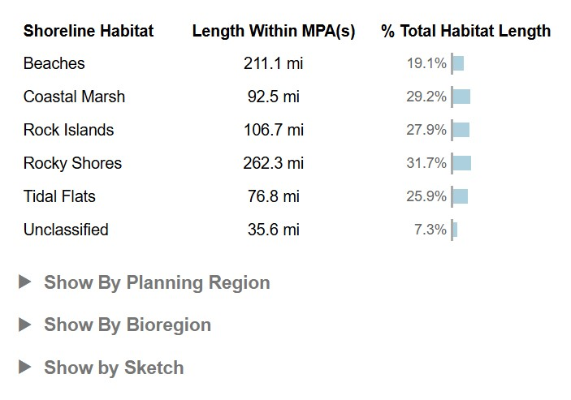
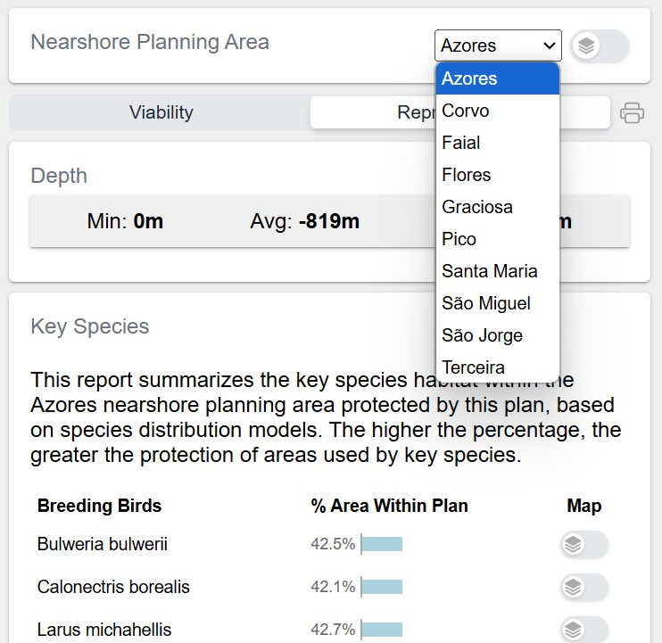

# Multiple Planning Boundaries

Sometimes a planning process may need to support multiple distinct non-overlapping planning units, so that planning can be done in each unit independently, with its own planning targets/objectives. For example the California MLPA planning process has 4 geographically distinct planning regions - North, North Cental, Central, South.

The California MLPA process also considers a completely different system of planning units called bioregions of which there are 3 - Central, North, South.

Some projects might need to support multiple sets of planning units within a larger overall planning. The overall planning area overlaps with each of the planning units.

So seports might be required to calculate how well each Sketch/Sketch Collection meets planning objectives for **each of the planning units** as well as the overall planning boundary. If a % value metric is to be calculated (value in sketch / value overall), this requires calculating what portion of each Sketch is in each unit as well as how much value for each datasource is in each unit.

The geoprocessing framework solves all of these use cases using [geographies](../concepts/Concepts.md#geographies), and the helper functions for working with them.

If the user will be presented with metrics for all geographies at once, then you can [iterate over the geographies](https://github.com/seasketch/california-reports/blob/main/src/functions/eelgrass.ts#L44) in your geoprocessing function to calculate metrics and display them in your report client.

```typescript
geographies.map(async (geography) => {
  const classMetrics = await Promise.all(
    metricGroup.classes.map(async (curClass) => {
      // calculate metrics
    }
  )
}
```

In the report client, you can display overall metrics, and allow the user to dig into metrics by planning unit and by sketch.



## Geography Switcher

If a simpler report user experience is needed, where the user should work with only a single planning unit at a time, then you can use a [GeographySwitcher](../api/client-ui/functions/GeographySwitcher.md). It's a component inserted in the top-level report client


