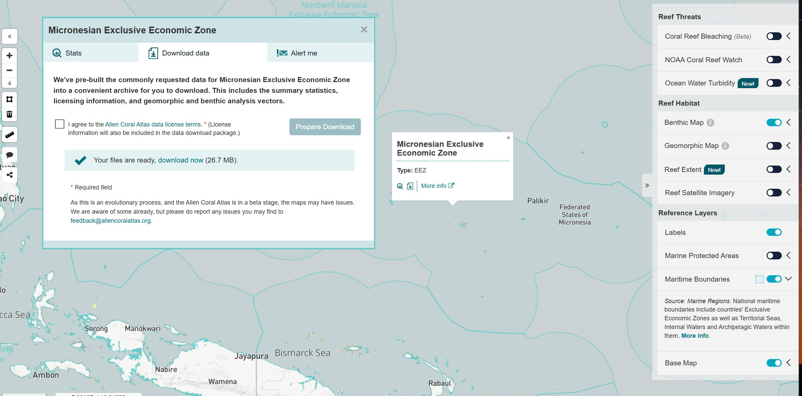

# Third Party Data

With all datasets, it is important to check if there is an authoritative dataset that should be used. The sources below are diverse and may offer more accuracy, but they are not necessarily authoritative.

## Global datasources

A number of global datasources are published in the [global-datasources](https://github.com/seasketch/global-datasources) project.

These are already published as cloud-optimied GeoTIFF's and flatgeobuf files and you can add them to your `datasources.json` file.

## Marine Regions

The [Marine Regions](https://marineregions.org/downloads.php) website is a good starting point for boundaries relevant to marine planning including EEZ, territorial sea, etc.

It's not always the most accurate, but it has global coverage. If the coastline for the EEZ dataset is not accurate enough you can take the "marine and land zones" dataset and then punch out the land holes using the OSM land dataset below.

## OSM Land

The [OSM Land](https://osmdata.openstreetmap.de/data/land-polygons.html) is a regularly updated coastline dataset. This can be a more accurate dataset than Marine Regions, particularly with coverage of very small islands that are near sea level. This dataset is the most likely to match up with map providers like Mapbox.

## Allen Coral Atlas

Access this data as follows:

- Go to [Allen Coral Atlas](https://allencoralatlas.org) and loging or register an account
- Once logged in, go to Micronesia on the atlas page - https://allencoralatlas.org/atlas/#4.51/6.3220/153.7907
- Turn on Maritime Boundaries in the layer menu on the right
- Click the Micronesia EEZ on the map
- Click the small Download button that appears in the map popup (icon of a page with a down arrow)
- Agree to the terms and click to Prepare Download
- Extract your downloaded zip file and look for `Reef-Extent/reefextent.gpkg` and `Benthic-Map/benthic.gpkg`, and make the data accessible to your project through one of the data linking methods described above.

