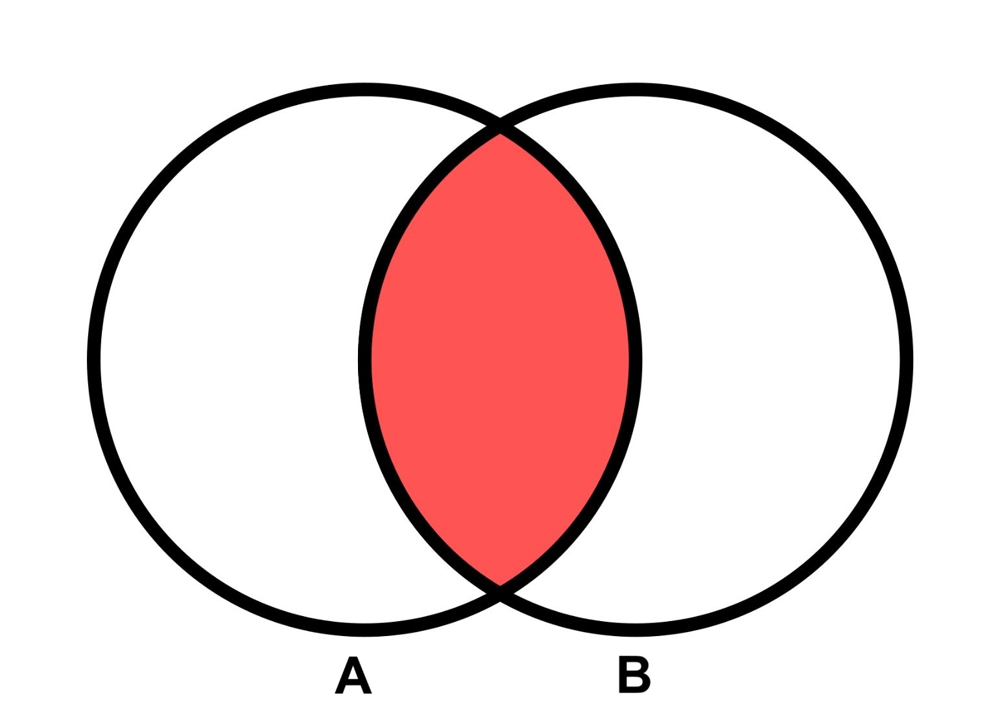
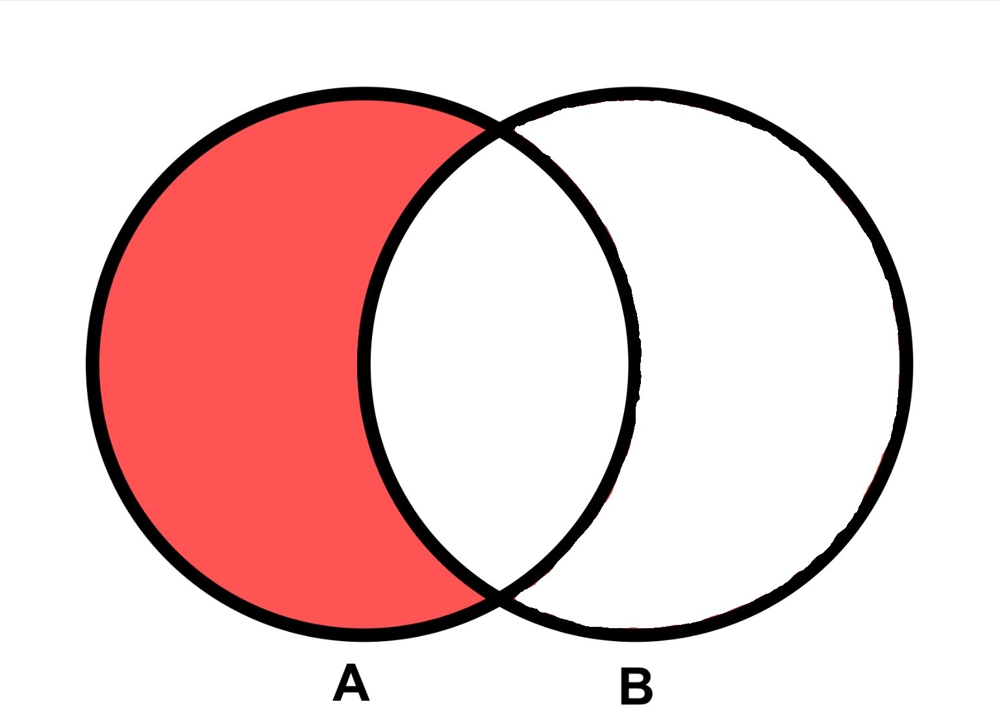
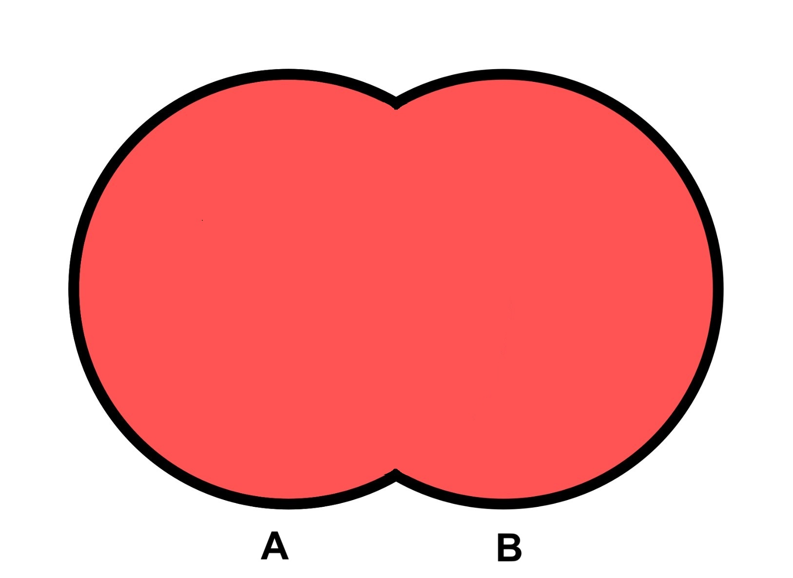

# Toolbox

## Polygon Clipping

Common spatial questions you'll want to answer are:

- what is the portion of a Polygon A overlaps with another Polygon B?
- what is the portion remaining in Polygon A if I remove the part overlapping with Polygon B?
- what is the result of merging a set of overlapping Polygons such that their overlap is removed?

You can answer these questions with a combination of geometric clip operations.

| Intersection                                              | Difference                                          | Union                                |
| --------------------------------------------------------- | --------------------------------------------------- | ------------------------------------ |
|  |  |  |
| overlap of A and B                                        | A minus B                                           | A or B                               |

The geoprocessing library offers multiple functions that are variations of these operations:

### Clip

`clip` - clip a FeatureCollection using one of 4 different clip operations.

- `intersection` - returns polygon(s) representing the shared area that all of the features in the collection have in common.
  - the clip function sees each of the features in the input collection as independent, which means if you have 10 polygons it will return the area all 10 polygons have in common. If what you want is to clip a feature A against a collection of other features B as a single unit, check out clipMultiMerge, it does the work of merging the features B into one big multipolygon for you. Otherwise you can loop through and intersect A with each feature in B one at a time, or you can call union on your group of features B first, then intersect with feature A.
- `difference` - takes the first item in the feature collection and erases any part of it that overlaps with the remaining items in the feature collection. Think of it as a series of substractions and order your input collection appropriately.
  - Similar to ArcGIS Erase or [QGIS Difference](https://docs.qgis.org/3.34/en/docs/user_manual/processing_algs/qgis/vectoroverlay.html#difference)
- `union` - returns a polygon/multipolygon that is the combination of all features with their overlap merged/dissolved.
  - Similar to ArcGIS Dissolve or [QGIS Dissolve](https://docs.qgis.org/3.34/en/docs/user_manual/processing_algs/qgis/vectorgeometry.html#dissolve)
  - A common use case for this is is to remove overlap in your data so that you don't double count their area, before doing further operations like intersecting with another set of features.
  - For example if you need to calculate the area of your entire sketch collection, and the sketches overlap, then simply calculating the area of each individual sketch polygon and summing them will double count any overlap and produce an invalid result. The solution is to union the sketch collection first then takes its area.
  - Another example is if you have a coral reef dataset with overlapping polygons, and you just want to calculate the total geographic area of all reef, then the union is what you want to do first before calculating area.

Examples:

See [polygon-clipping](https://github.com/mfogel/polygon-clipping#readme) library used under the hood.

```typescript
import { clip } from "@seasketch/geoprocessing";
```

### clipMultiMerge

- `clipMultiMerge` - this is convenience function that takes as input a single polygon featureA, and collection featuresB. featuresB is merged into a single multipolygon before being used to clip feature A.
  - This is necessary when you want to find the intersection of featureA and any part of featuresB. You need featuresB to be seen as a single unit when calling the clip function, not independenct polygons.
  - Used by intersectInChunks and intersectInChunksArea

### Sequenced Clip Operations

To quickly perform a sequence of clip operations against different sets of data the following functions are available:

- [clipToPolygonFeatures](../api/geoprocessing/functions/clipToPolygonFeatures.md) - takes a Polygon feature and returns the portion remaining after performing one or more clipOperations (intersection or difference) against multiple sets of features. Multiple additional configuration options.
  `clipToPolygonDatasources` - takes a Polygon feature and returns the portion remaining after performing one or more clipOperations (intersection or difference) against one or more Datasources.

These are meant to simplify creating preprocessors. They use `ensureValidPolygon` to optionally enforce a minimum and maximum size for the results, as well as how to handle if the result have more than one polygon.

See `src/functions/clipToOcean.ts`, `src/functions/clipToLand.ts`, and `src/functions/clipToOceanEez.ts` in your project for examples of usage.

### Higher Level Intersection

- `intersectInChunks` - calculates area overlap between a feature A and a feature array B. Intersection is done in chunks on featuresB to avoid errors due to too many features.

The following two functions intersect two sets of features and calculate a metric with the remainder.

- `intersectInChunksArea` - calculates area overlap between a feature A and a feature array B. Intersection is done in chunks on featuresB to avoid errors due to too many features.
  - used by overlapFeatures()
- `intersectSum` - sums a property value of intersecting features. No support for partial.
  - used by overlapFeatures()

## Vector Zonal Stats

- `overlapFeatures` - calculates zonal statistics for a sketch(es) with an array of polygon features.
  - high-level function that returns an array of Metric objects.
  - Supports area or sum operation (given sumProperty), defaults to only area.
  - If sketch collection is input, calculates overall overlap stats as well as per child sketch.
  - handles overlap of sketch features so that overlap is not double counted in area/sum stats.

## Raster Zonal Stats

Geoblaze can be used directly for calculating zonal raster statistics including filtering to overlap with a Sketch feature. The geoprocessing framework offers some convenience functions that extend them with additional functionality:

### High-level

- [rasterMetrics](../api/geoprocessing/functions/rasterMetrics.md) calculate summary metrics (statistics/area) on a loa. If `sketch` is passed will limit to raster values overlapping with the sketch (zonal statistics). Similar to `rasterStats` but results are returned in a standardized `Metric` array format.
  - If `feature` is a collection, then calculate metrics for each individual feature as well as the collection as a whole. This can be disabled by passing `includeChildMetrics: false`. If your raster is a categorical raster you should pass `categorical: true` and optionally pass the list of `categoryMetricsValues` to pull out of the raster.
  - [Examples](https://github.com/search?q=org%3Aseasketch+rasterMetrics%28&type=code)
  - [Categorical example](https://github.com/seasketch/california-reports/blob/98cd29fc0da86707bfde9aa6f3ecf30c0e5db23a/src/functions/kelpMaxWorker.ts#L61)

Older and lesser used functions:

- `overlapRasterClass` - calculates sum of overlap between sketches and a categorical raster with numeric values representing feature classes
- `overlapRasterSum` - returns sum of cells overlapping sketch with raster as a metric object
- `overlapRasterArea` - returns area of sketch overlap with raster as a metric object

### Low-level

- [rasterStats](../api/geoprocessing/functions/rasterStats.md) - is a lower-level all-in-one function for calculating up to 10 different raster stats in a single pass.
  - includes calculation of are not currently supported by geoblaze. Supported through use of equal area raster projection.
  - Optionally constrains to raster cells overlapping with feature.

Older and lesser used functions:

- [getSum](../api/geoprocessing/functions/getSum.md) - returns sum of raster cell values overlap with feature. (not multi-band aware, first band only)
- [getArea](../api/geoprocessing/functions/getArea.md) - returns area of valid raster cell values (not nodata) overlapping with feature. (not multi-band aware, first band only)

## Group Overlap Analysis

Calculate group-level metrics by assigning sketches to groups (e.g. group by protection level)

High-level:

- `overlapFeaturesGroupMetrics` - generate overlap metrics for groups of sketches using overlapFeatures operation.
- `overlapRasterGroupMetrics` - generate overlap metrics for groups of sketches using rasterMetrics operation
- `overlapAreaGroupMetrics` - generate overlap metrics for groups of sketches using overlapArea operation.

Low-level:

- `overlapArea` - calculates the area of each sketch and the proportion of outerArea they take up.
  - used by overlapAreaGroupMetrics.
- `overlapGroupMetrics` - given overlap metrics (vector or raster) stratified by class and sketch, returns new metrics also stratified by group. Assumes a sketch is member of only one group, determined by caller-provided metricToGroup.
  - used by all high-level group metrics functions

## Precision
