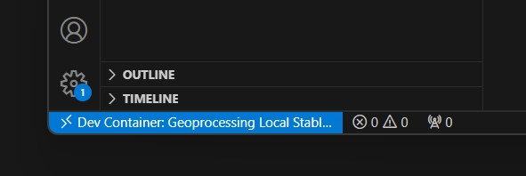
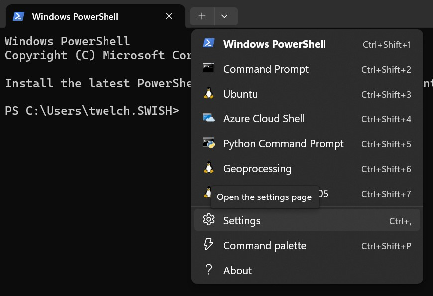
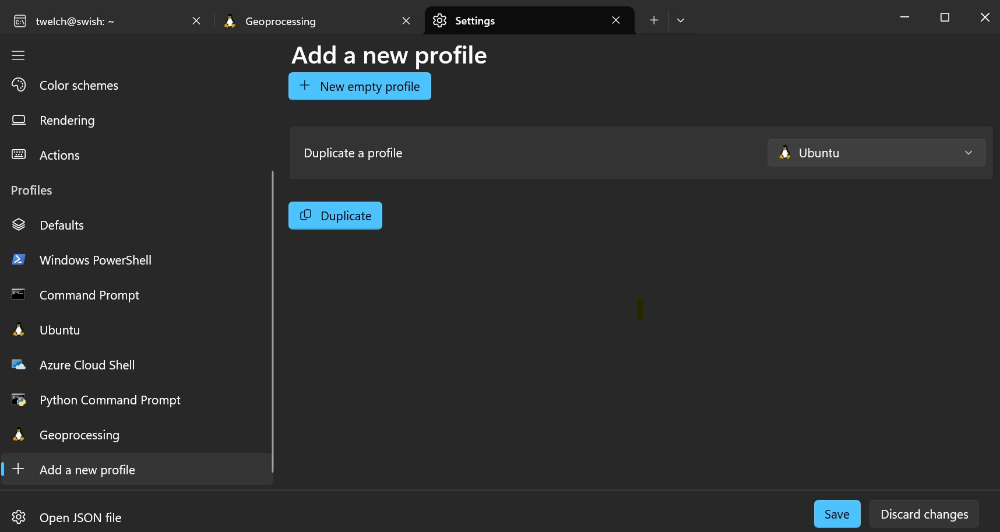

# System Setup

import { NodeVersion, UbuntuVersion } from '../\_components/NodeVersion';

These tutorials will walk you through creating and deploying a basic seasketch `geoprocessing` project. You should already have a basic working knowledge of your computer, its operating system, shell environment (command line), and web application development using NodeJS and React. Learn more about the [skills](../introduction.md) required.

Setup options:

- MacOS
  - [Virtual install with Docker Desktop](#virtual-install-with-docker-desktop)
  - [Direct Install on MacOS](#macos-direct-install)
- Windows
  - [Virtual install with Windows Subsystem for Linux (WSL)](#windows-wsl-install)
  - [Virtual install with Docker Desktop](#virtual-install-with-docker-desktop)
  - Direct Install on Windows not supported
- Ubuntu Linux
  - [Virtual install with Docker Desktop](#virtual-install-with-docker-desktop)
  - [Direct Install on Ubuntu](#ubuntu-direct-install)
- [Github codespaces](../codespaces/)
  - Possible but not well tested

A virtual environment is the recommended way for beginners to develop geoprocessing projects. Docker Desktop is the recommended methods on MacOS and Linux. WSL is the recommended method on Windows.

## Virtual Install With Docker Desktop

Docker Desktop allows you to run containerized applications that are isolated from your host operating system. It's similar but different from a virtual machine. SeaSketch publishes the [docker-gp-workspace](https://github.com/seasketch/docker-gp-workspace) container image that is a fully-configured environment for developing geoprocessing projects. It allows you to get up and running quickly and has persistent storage. The downside is that code runs a bit slower in a container than directly on your system.

Install steps for all operating systems:

- Install [Docker Desktop](https://www.docker.com/products/docker-desktop/) on your host operating system and make sure it's running.
  - If you have a Mac, choose either Apple processor or Intel processor as appropriate. If you don't know, click the apple icon in the top left and select `About This Mac` and look for `Processor`.
- Install [VS Code](https://code.visualstudio.com) on your host operating system and open it.
- Clone the geoprocessing-devcontainer Github repository to your host operating system, and open that folder in VSCode.
  - From VSCode, click `Open Folder` button or `File -> Open Folder` and create or choose a folder where you keep source code. A folder called `src` or `code` in your users home directory is reasonable. Then click `Select Folder` to finish.
  - Press `Ctrl-J` or `Cmd-backtick` to open a terminal. The current directory of the terminal will be your workspace folder.
  - Enter the command to clone the geoprocessing-devcontainer repository to your workspace.
    - `git clone https://github.com/seasketch/geoprocessing-devcontainer`
    - If you had previously cloned this repository then update it now with `cd geoprocessing-devcontainer && git pull`
  - Click `Open Folder` button or `File -> Open Folder` and open the repo folder you just cloned.
  - Press `Ctrl-J` or `Cmd-backtick` to open a terminal again.
- Install required VSCode extensions. You may be prompted to do this, otherwise go to the `Extension` panel found on the left side of the VSCode window. Then install the following extensions:
  - Remote Development
  - Remote Explorer
  - Docker
  - Dev Containers

Once you have added the `Dev Containers` extension you should be prompted to "Reopen folder to develop in a container". <b>_Do not do this yet._</b>

- In the file `Explorer` panel, open the `.devcontainer` folder.
  - This top-level folder contains the configuration for the `stable` geoprocessing devcontainer you will use.
- Make a copy of `.devcontainer/.env.template` file and name it `.env`.
  - You don't need to add anything yet to your .env file, but it is required that it exists in the `.devcontainer` folder.

Now start the devcontainer:

- `Ctrl-Shift-P` or `Cmd-Shift-P` to open the VSCode command palette
- type “Reopen in container” and select the Dev Container command to do so.
- Select the `Geoprocessing Local Stable` environment.
- VSCode will pull the latest `geoprocessing-workspace` docker image, create a container with it, and start a remote code experience inside the container.
- Notice the bottom left blue icon in your vscode window. It may say `Opening remote connection` and eventually will say `Dev Container: Geoprocessing`. This is telling you that this VSCode window is running in a devcontainer environment.



You now have a devcontainer, ready to create a project in.

To exit your devcontainer:

- Click the blue icon in the bottom left, and then `Reopen locally`. This will bring VSCode back out of the devcontainer session.
- You can also type `Ctrl-Shift-P` or `Cmd-Shift-P` and select `Dev Containers: Reopen folder locally`.


- To update to the latest `geoprocessing-workspace` Docker image at any point you simply use a different VSCode command to start it:
  - `Ctrl-Shift-P` or `Cmd-Shift-P` to open the VSCode command palette
  - type "Dev Containers: Rebuild Without Cache and Reopen In Container"

See devcontainer advanced usage [guide](../devcontainer/devcontainer.md) to learn more or the [upgrade](../upgrade.md) tutorial

## MacOS Direct Install

Requirement: 11.6.8 Big Sur or newer

Install all software dependencies directly on your Apple machine running the MacOS operating system:

- Install [Node JS](https://nodejs.org/en/download/) >= <NodeVersion />
  - [nvm](https://github.com/nvm-sh/nvm) is great for this
    - First, install nvm. May ask you to first install XCode developer tools which is available through the App Store or follow the instructions provided.
    - Then <code>nvm install v<NodeVersion /></code>.
  - Then open your Terminal app of choice and run `node -v` to check your node version
- Install latest [NPM](https://www.npmjs.com/) package manager after installing node.
  - `npm --version` to check
  - `npm install -g latest`
- Install [VS Code](https://code.visualstudio.com)

  - Install recommended [extensions](https://code.visualstudio.com/docs/editor/extension-marketplace) when prompted. If not prompted, go to the `Extensions` panel on the left side and install the extensions named in [this file](https://github.com/seasketch/geoprocessing/blob/dev/packages/geoprocessing/templates/project/.vscode/extensions.json)

- Install [GDAL](https://gdal.org/)

  - First install [homebrew](https://brew.sh/)
  - `brew install gdal`

- Install [Java runtime](https://www.java.com/en/download/) for MacOS (required for testing with Amazon DynamoDb Local)

- Create a free Github account if you don't have one already

## Windows WSL Install

Requirement: Windows 11 or newer

Why use Windows Subsystem for Linux (WSL) to develop geoprocessing projects instead of using the [Docker Desktop](#virtual-install-with-docker-desktop)? Because WSL is faster than Docker Desktop alone. And because WSL provides a built-in filesystem bridge allowing you to access all your Windows drives in the Ubuntu container (via `/mnt` path).

To get started in Windows:

- Install [Powershell for Windows](https://learn.microsoft.com/en-us/powershell/scripting/install/installing-powershell-on-windows?view=powershell-7.4)
- Install [WSL with Ubuntu distribution](https://learn.microsoft.com/en-us/windows/wsl/install)
  - If you already have WSL Version 2 installed, make sure it's up to date by running `wsl --update` in PowerShell
  - Install the default Ubuntu distribution as directed.
- Install [Docker Desktop with WSL2 support](https://docs.docker.com/desktop/windows/wsl/).
  - Once installed, make sure Docker Desktop is running
  - If you already had Docker Desktop installed, make sure it's updated to the latest version.
- Install [VS Code](https://learn.microsoft.com/en-us/windows/wsl/tutorials/wsl-vscode) for Windows with WSL extension.

### Geoprocessing Distribution

A version of the [geoprocessing-workspace](https://github.com/seasketch/docker-gp-workspace) Docker image has been packaged by the SeaSketch team for running in WSL. It's pre-configured with all dependencies. You can download, import, and run it right alongside the default Ubuntu distribution.

- Open Powershell in Windows
- Create a tmp directory

```bash
mkdir C:\tmp
```

- Download the most recent `geoprocessing-workspace` zip file from the [SeaSketch Box folder](https://ucsb.box.com/s/k9477fqzzn0yel5kf5kj2y81tst09f4i) to this tmp directory and then unzip it.

- Create a second directory to import the Geoprocessing tar image too, then import it:

```bash
mkdir C:\WslDistributions\Geoprocessing
wsl --import Geoprocessing C:\WslDistributions\Geoprocessing\ C:\tmp\geoprocessing-workspace_20230627\geoprocessing-workspace_20230627_65bd30ba63a3.tar
```

- Be sure to update the filename in the import command above to match the version you downloaded.
- If import is started correctly, you will see the message `Import in progress, this may take a few minutes...`. Once done it should say `The operation completed successfully`. If it didn't import successfully, try restarting your system, WSL may not have been running properly.

- Setup Terminal Profile
  - This will create a shortcut to start an instance of Geoprocessing in WSL.
  - In PowerShell, click the down arrow in the tab bar, to the right of the (+) icon, then click Settings.



- Find the Profiles section in left sidebar -> click `Add a new profile`
- The, under `Duplicate a profile`, click `Ubuntu`, then `Duplicate` button.



- Change the name of the duplicated Ubuntu profiles to `Geoprocessing`
- Change the profiles Terminal command from `C:\WINDOWS\system32\wsl.exe -d Ubuntu` to `C:\WINDOWS\system32\wsl.exe -u vscode -d Geoprocessing`. This will ensure that Geoprocessing starts with the correct user, instead of root.
- Save and exit your new profile
- The Terminal dropdown menu should now have a new `Geoprocessing` choice. Click this to start an instance of the Geoprocessing Distribution. It will open a shell, logged in with the vscode user.

In the Geoprocessing shell, setup the workspaces directory where you will create projects:

```bash
sudo mkdir /workspaces
sudo chmod 777 /workspaces
cd /workspaces
```

Now open VSCode in your workspaces directory:

```bash
code .
```

Install recommended VSCode [extensions](https://code.visualstudio.com/docs/editor/extension-marketplace) when prompted. If not prompted, go to the `Extensions` panel on the left side and install the following extensions

- Remote Development
- Remote Explorer
- Docker
- Dev Containers

Check to make sure you have access to your Windows filesystem:

```bash
ls /mnt/c
```

Follow the [final configuration steps](#final-configuration---all-install-options) below, then move on to creating a new project.

[Upgrade](../upgrade.md#upgrade-windows-geoprocessing) steps for the Geoprocessing Distribution are available.

### Default Ubuntu Distribution

Only follow these install steps if you intend to setup and use the default Ubuntu Distribution in WSL _instead of_ the pre-configured Geoprocessing Distribution (above).

Supported Ubuntu version: <UbuntuVersion />

- Open Windows start menu -> start typing `Ubuntu on Windows` -> Select `Ubuntu on Windows`
  - This will start Ubuntu virtual machine and open a bash shell in your home directory.

In Ubuntu shell:

- Install [Java runtime](https://stackoverflow.com/questions/63866813/what-is-the-proper-way-of-using-jdk-on-wsl2-on-windows-10) in Ubuntu (required by AWS CDK library)
- Install [Git in Ubuntu and Windows](https://learn.microsoft.com/en-us/windows/wsl/tutorials/wsl-git)
- Install [VS Code](https://learn.microsoft.com/en-us/windows/wsl/tutorials/wsl-vscode) in Windows and setup with WSL2.
  - Install recommended [extensions](https://code.visualstudio.com/docs/editor/extension-marketplace) when prompted. If not prompted, go to the `Extensions` panel on the left side and install the extensions named in [this file](https://github.com/seasketch/geoprocessing/blob/dev/packages/geoprocessing/templates/project/.vscode/extensions.json)
- Install [Node JS](https://nodejs.org/en/download/) >= <NodeVersion /> in Ubuntu
  - [nvm](https://github.com/nvm-sh/nvm) is great for this
    - First, install nvm. May ask you to first install XCode developer tools which is available through the App Store or follow the instructions provided.
    - Then <code>nvm install v<NodeVersion /></code>.
  - Then open your Terminal app of choice and run `node -v` to check your node version
- Install latest [NPM](https://www.npmjs.com/) package manager after installing node.
  - `npm --version` to check
  - `npm install -g latest`

## Ubuntu Direct Install

Requirement: Ubuntu <UbuntuVersion /> or newer

Setup is for a physical machine running the Ubuntu operating system.

From a Ubuntu terminal with root access, simply follow the steps above for [default ubuntu installation](#default-ubuntu-distribution)

## Final Configuration - all install options

The last step, regardless of install option, is to set the [username](https://docs.github.com/en/get-started/getting-started-with-git/setting-your-username-in-git?platform=mac) and email address git will associate with your commits.

You can set these per repository, or globally for all repositories on your system (and override as needed). Here's the commands to set globally for your environment.

```bash
git config --global user.name "Your Name"
git config --global user.email "yourusername@youremail.com"
```

Now verify it was set:

```bash
# If you set global - all repos
cat ~/.gitconfig

# If you set local - current repo
cat .git/config
```

Your environment is now ready for a project
