# Create Sample Project

This tutorial walks through creating a sample geoprocessing project for the Federated States of Micronesia. It demonstrates multiple methods for doing spatial analysis and creating reports, from low-level to high-level, so that you can engage with it at any/all of the levels needed for your project.

The planning area for this example is defined as extending from the Micronesia baseline (coastline/shoreline) to the outer boundary of the Exclusive Economic Zone (200 nautical miles).

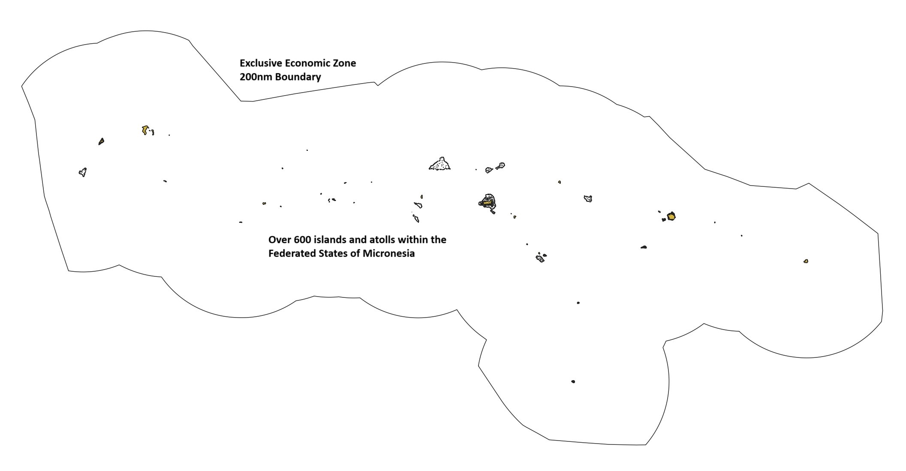

This tutorial assumes:

- Your [system setup](./Tutorials.md) is complete
- Your geoprocessing virtual environment is running (Devcontainer or WSL)
- You have VSCode open in your virtual environment with a terminal pane open

Have questions along the way? Start a [discussion](https://github.com/seasketch/geoprocessing/discussions) on Github

## Initialize Geoprocessing Project

Start the project `init` process, which will download the framework, and collect required project metadata.

```sh
cd /workspaces
npx @seasketch/geoprocessing@7.0.0-beta.10 init 7.0.0-beta.10
```

```text
? Choose a name for your project
fsm-reports-test
? Please provide a short description of this project
Micronesia reports
? Source code repository location
[LEAVE BLANK]
? Your name
[YOUR_NAME]
? Your email
[YOUR_EMAIL]
? Organization name (optional)
Example organization
? What software license would you like to use?
BSD-3-Clause
? What AWS region would you like to deploy functions in?
us-west-1
? What languages will your reports be published in, other than English? (leave blank for none)
Chuukese
Kosraean
```

After pressing Enter, your project will be created and all NodeJS software dependencies installed. If your language is not present, you will be able to add it later.

Now, re-open VSCode one level deeper, in your project folder::

```text
File -> Open Folder
Type /workspaces/fsm-reports-test/
Press Ctrl-J or Ctrl-backtick to open a new terminal
```

## Create Git repo

Before you continue, let's create a local git repository and commit everything so far as a starting point.

```bash
git init
git add .
git commit -m "first commit"
git branch -M main
```

After this point, you can continue using git commands in the terminal to stage code changes and commit them if that's what you know, or you can use VSCode's [built-in git support](https://code.visualstudio.com/docs/sourcecontrol/overview).

To learn more about your projects folder structure, visit the [structure](../structure.md) page.

## Preprocessing

Preprocessing functions are invoked by the SeaSketch platform, on a user-drawn shape, right after the user finishes drawing it. It's a specialized function that validates a drawn shape and potentially modifies it, such as to remove portions of the shape outside the planning boundary. This "clipping" of the shape is useful in that it allows a user to overdraw beyond the planning boundary and it will be clipped right to the edge of that boundary.

Here is an example of a preprocessor clipping a user drawn polygon to erase any part overlapping with land

| Before Clip                                           | After Clip                                         |
| ----------------------------------------------------- | -------------------------------------------------- |
| 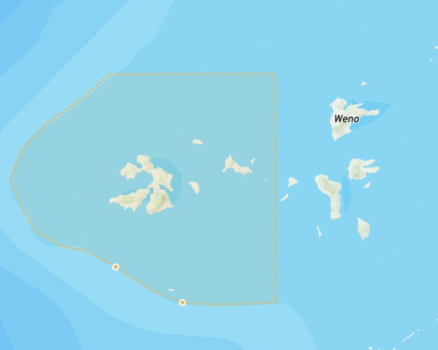 | 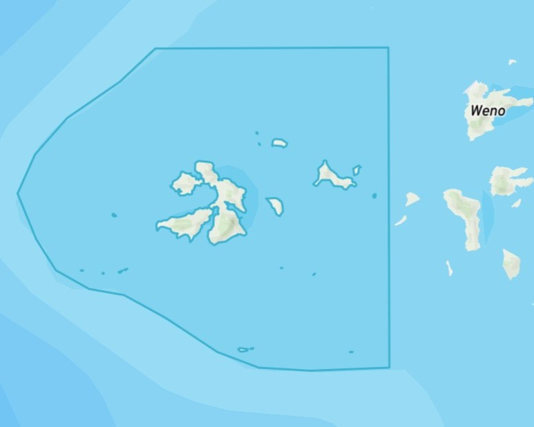 |

In the `src/functions` directory you will find four preprocessing functions that come with every project, and they are further configureable to meet your needs:

- `validatePolygon` - verifies shape is not self-crossing, is at least 500 square meters in size, and no larger than 1 million square kilometers.
- `clipToLand` - clips the shape to just the portion on land, as defined by OpenStreeMap land polygons. Includes validatePolygon.
- `clipToOcean` - clips the shape to remove the portion on land, as defined by OpenStreetMap land polygons. Includes validatePolygon.
- `clipToOceanEez` - clips the shape to keep the portion within the boundary from the coastline to the outer boundary of the EEZ. Includes validatePolygon.

### Testing

Each preprocessing function has its own unit test and smoke test file. For example:

- Unit: `src/functions/validatePolygon.test.ts`
- Smoke: `src/functions/validatePolygonSmoke.test.ts`

**Unit tests** ensure the preprocessor produces exact output for very specific input features and configuration, and throws errors properly.

**Smoke tests** are about ensuring the preprocessor behaves properly for your project location, and that its results "look right" for a variety of input features. It does this by loading example shapes from the project `examples/features` directory. It then runs the preprocessing function on the examples, makes sure they produce output, and saves them to `examples/output`.

To test your preprocessing functions, we need to create example features within the extent of our Micronesian planning area. To do this, run the following script:

```bash
npx tsx scripts/genRandomPolygon.ts --outDir examples/features --filename polygon1.json --bbox "[135.31244183762126,-1.1731109652985907,165.67652822599732,13.445432925389298]"
npx tsx scripts/genRandomPolygon.ts --outDir examples/features --filename polygon2.json --bbox "[135.31244183762126,-1.1731109652985907,165.67652822599732,13.445432925389298]"
```

This will output an example Feature and an example FeatureCollection to `examples/features`.

Now run the tests:

```bash
npm test
```

You can now look at the geojson output files in the `examples/output` directory, including visually by opening them in QGIS or pasting the JSON into geojson.io. This is the best way to visually verify the preprocessor worked as expected.

This is a good checkpoint to commit your latest changes to Github.

To learn more about preprocessing, check out the [guide](../preprocessing.md)

## Simple Report

Your new project comes with a simple report that calculates the area of a sketch or sketch collection and presents it in a human readable format. Let's look at the pieces that go into this report.

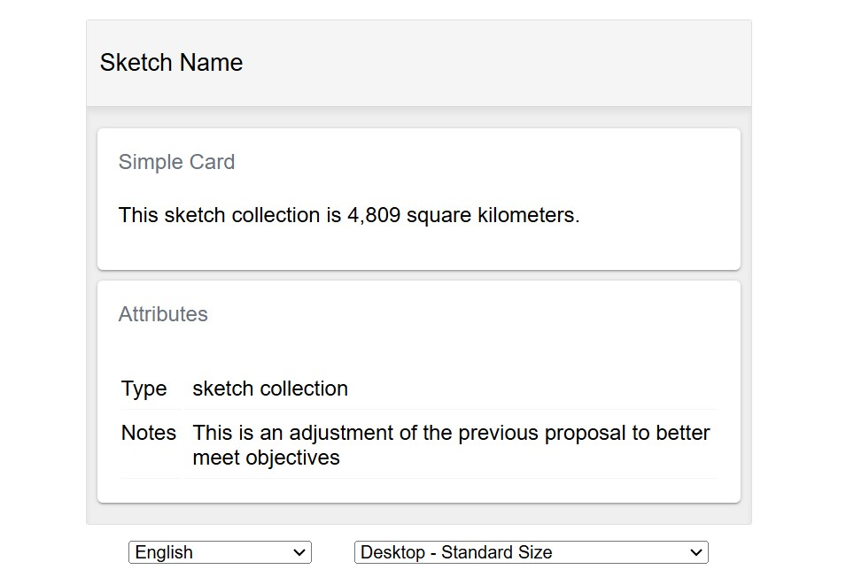

### simpleFunction

The area calculation is done within a geoprocessing function in `src/functions/simpleFunction.ts`.

Geoprocessing functions are invoked by a report client, as soon as its loaded in the browser by SeaSketch. It's a specialized function that takes a Sketch polygon or collection of Sketch polygons, performs some analysis, and returns the result to be displayed in the report client.

Open `src/functions/simpleFunction.ts` and you will notice this function defines a custom result payload called `SimpleResults`, which in this case is a Javascript object with an `area` property containing a number value.

```typescript
export interface SimpleResults {
  /** area of sketch within geography in square meters */
  area: number;
}
```

`simpleFunction` starts off with the basic signature of a geoprocessing function. It accepts a `sketch` parameter that is either a single `Sketch` polygon or a `SketchCollection` with multiple Sketch polygons. Unless your planning project only requires users to design single sketches and not collections, your geoprocessing function must be able to handle both.

```typescript
async function simpleFunction(
  sketch:
    | Sketch<Polygon | MultiPolygon>
    | SketchCollection<Polygon | MultiPolygon>,
): Promise<SimpleResults> {
```

The function then performs its analysis and returns the result.

```typescript
// Add analysis code
const sketchArea = area(sketch);

// Custom return type
return {
  area: sketchArea,
};
```

Below that, a new `GeoprocessingHandler` is instantiated, with simpleFunction passed into it. Behind the scenes, this wraps simpleFunction in an AWS Lambda handler function, which once deployed to AWS, allows the geoprocessing function to be invoked using an API call, by a report client running in a web browser.

```typescript
export default new GeoprocessingHandler(simpleFunction, {
  title: "simpleFunction",
  description: "Function description",
  timeout: 60, // seconds
  memory: 1024, // megabytes
  executionMode: "async",
});
```

`GeoprocessingHandler` requires a `title` and `description`, which uniquely identifies the function that will be published by your project. It also accepts some additional parameters defining what resources the Lamda should have, and its behavior:

- `timeout`: how many seconds the Lambda will run before it times out in error.
- `memory`: memory allocated to the Lambda, can go up to 10,240 MB. Number of processors increase with memory size automatically.
- `executionMode`: determines how the report client waits for geoprocessing function results, defaults to async. Sync - wait with connection open for immediate results, Async - wait for web socket message that results are ready, then fetch. Sync should only be used for very fast geoprocessing functions (1-2 seconds max). Think of it as a performance optimization.

You can change all these parameter values to suit your needs, but the default values are suitable for now.

`simpleFunction` is already registered as a geoprocessing function in `project/geoprocessing.json`.

Now let's look at the browser report client that invokes this function.

### SimpleReport

A report client is a top-level React component for rendering a report in the users web browser. Report clients are located in the `src/clients` directory and are responsible for the layout of one or more `Card` components. Cards are able to invoke geoprocessing functions and display their results.

The two report clients that come with your project are:

- `SimpleReport.tsx` - simple one page report client containing a SketchAttributesCard and a SimpleCard.
- `TabReport.tsx` - more complex multi-page report layout controlled by a tab switcher component, so that only one page is in view at a time.

Both these report clients are already registered in `project/geoprocessing.json`. To start, let's focus on `SimpleReport` and `SimpleCard`.

```jsx
export const SimpleReport = () => {
  return (
    <Translator>
      <SimpleCard />
      <SketchAttributesCard autoHide />
    </Translator>
  );
};
```

SimpleReport renders two cards, `SimpleCard` and `SketchAttributesCard`, wrapping them in a languge `Translator` component (you will learn more about this later).

`SketchAttributes` card is a card component that displays the properties of the users Sketch. No geoprocessing function is needed to do its work.

`SimpleCard` is a card component that invokes simpleFunction and displays its results. Let's look at it closer.

The first thing to notice is that SimpleCard renders a `ResultsCard` component. Behind the scenes ResultsCard invokes the geoprocessing function with the `functionName` provided (simpleFunction). Keep in mind that in a production environment the ResultsCard is rendered in your web browser and the geoprocessing function is a Lambda function in Amazon's cloud invoked via an API call.

```typescript
<ResultsCard title={titleTrans} functionName="simpleFunction">
```

ResultsCard then contains a render function that is provided with the results.

```typescript
{
  (data: SimpleResults) => {
    const areaSqKm = data.area / 1_000_000;
    const areaString = roundDecimalFormat(areaSqKm, 0, {
      keepSmallValues: true,
    });
    const sketchStr = isCollection ? t("sketch collection") : t("sketch");

    return (
      <>
        <p>
          <Trans i18nKey="SimpleCard sketch size message">
            This {{ sketchStr }} is {{ areaString }} square kilometers.
          </Trans>
        </p>
      </>
    );
  };
}
```

This render function takes an input parameter `data` that has the same type (`SimpleResults`) as the return type of `simpleFunction`. This gives you fully typed access to your report results.

The code in this render function is the heart of each report card. This particular card takes the `area` value it is given in square meters, and converts it to square kilometers. It then rounds it to a whole number, and formats it to make it more readable. Also notice that it renders a slightly different message depending on whether it is a single sketch or a sketch collection being reported on.

### Language Translation

The last thing to notice is that SimpleCard contains a lot of boilerplate for language translation of its strings (using [`react-i18next`](https://react.i18next.com/)). If your reports need to be multi-lingual you will need to to use these, otherwise you can drop them.

Language translation is a multi-part process:

- First, a combination of `useTranslation`, `t` function, and `Trans` components are used to establish which strings in your report client and components should be translated.
- Next, those translateable strings are extracted using the `extract:translation` command, and output to `src/i18n/lang/en/translation.json`. The strings extracted for SimpleCard are:

```text
{
  "sketch": "sketch",
  "sketch collection": "sketch collection",
  "SimpleCard sketch size message": "This {{sketchStr}} is {{areaString}} square kilometers.",
}
```

- The English translation file is then translated to the other needed languages and put into their own translation files
- The `Translator` component in your report client is then responsible for inspecting the users language at runtime in the browser and swapping the English strings for strings in the appropriate language.

This process is covered in more detail in a separate doc.

### Generate Examples

With a working geoprocessing function and report client already in place, you're ready to generate example sketches for testing them. We'll use the same `genRandomPolygon` script as before. But let's look closer at how we figured out the bounding box extent of the Micronesian planning area. First, use ogrinfo to inspect the Micronesia EEZ polygon data layer in your data package.

```bash
ogrinfo -so -json data/src/eez_withland_mr.fgb
```

Deep in its output you will see a `geometryFields` property, which contains the bounding box extent of the EEZ feature. Use the `jq` utility to extract this extent:

```bash
ogrinfo -so -json data/src/eez_withland_mr.fgb | jq -c .layers[0].geometryFields[0].extent
[135.31244183762126,-1.1731109652985907,165.67652822599732,13.445432925389298]
```

This will output an array with the extent of the EEZ. This is just one of multiple possible methods to get this extent. You are welcome to use the method that works best for you.

Now run the genRandomPolygon script with this extent. The following examples will create a Sketch polygon, and then a SketchCollection containing 10 Sketch polygons.

```bash
npx tsx scripts/genRandomPolygon.ts --outDir examples/sketches --filename sketch1.json --bbox "[135.31244183762126,-1.1731109652985907,165.67652822599732,13.445432925389298]" --bboxShrinkFactor 5 --sketch
npx tsx scripts/genRandomPolygon.ts --outDir examples/sketches --filename sketchCollection1.json --bbox "[135.31244183762126,-1.1731109652985907,165.67652822599732,13.445432925389298]" --bboxShrinkFactor 5 --sketch --numFeatures 10
```

The `--bboxShrinkFactor` argument used shrinks the height and width of the given bbox by a factor of 5, and then generates random features that are within that reduced bbox. A suitable shrink factor value was discovered through trial and error. Simply visualize the resulting json file in QGIS or other software and find a value that produces polygons that are completely within the planning area polygon. (see image below).

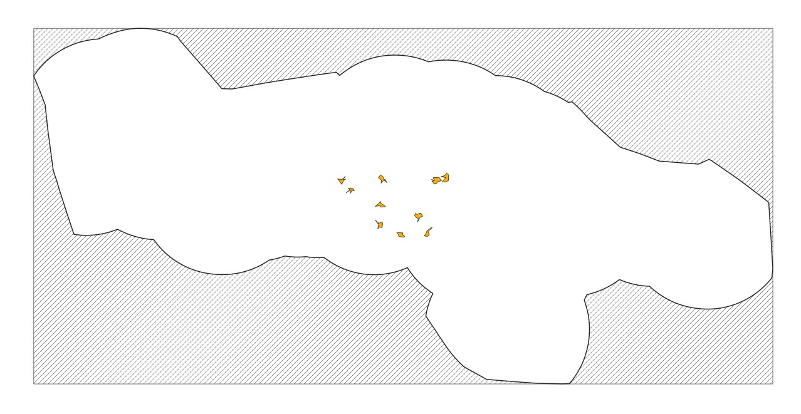
Image: cluster of 10 random sketches (in orange) within Micronesia EEZ

Learn more about the options for `genRandomPolygon` by running:

```
npx tsx scripts/genRandomPolygon.ts --help
```

### Run test suite

Now that you have example features and sketches, you can test `simpleFunction`. Run the test suite now:

```bash
npm test
```

- Using `simpleFunctionSmoke.test.ts`, simpleFunction will be run against all of the polygon Sketches in `examples/sketches`.
- The results of all smokes tests are output to the `examples/output` directory.
- You can inspect the output files, and see the calculated area values for each sketch input.

Commit the output files to your git repository at this time.

You can make changes to simpleFunction, then rerun tests to regenerate them at any time, and delete any that are stale and no longer needed. For advanced use, check out the [testing](../Testing.md) guide.

### Storybook

Storybook is used to view your reports.

```bash
npm run storybook
```

This will:

- Generate a story for every combination of report client registered in `project/geoprocessing.json` and sketch present in `examples/sketches`.
- Load all of the smoke test output for every sketch (to load in stories instead of running geoprocessing functions)
- Start the storybook server and give you the URL.

Open the storybook URL in your browser and click through the stories.


A powerful feature of Storybook is that when you save edits to your report client or component code, storybook will refresh the browser automatically with the changes. This lets you develop your reports and debug them more quickly.

There are a couple of situations that will cause you to need to stop your storybook server (Ctrl-C) and then restart it to pick up the changes.

- you add more sketch examples to your `examples/sketch` directory
- you rerun smoke tests and generate new test output

Learn more in the [storybook guide](./storybook.md).

### Simple Function Modifications

Let's enhance your simple geoprocessing function to calculate more detailed information when the report is run on a sketch collection. It should calculate the area of the entire collection, and the area of each child sketch in the collection.

First modify SimpleResults with an additional property `childSketchAreas` that can store this information:

```typescript
export interface SimpleResults {
  /** area of reef within sketch in square meters */
  area: number;
  childSketchAreas: {
    /** Name of the sketch */
    name: string;
    /** Area of the sketch in square meters */
    area: number;
  }[];
}
```

Then calculate the additional values and return them in the result payload:

```typescript
// Add analysis code
const sketchArea = area(sketch);

let childSketchAreas: SimpleResults["childSketchAreas"] = [];
if (sketch.properties.isCollection) {
  childSketchAreas = toSketchArray(sketch).map((sketch) => ({
    name: sketch.properties.name,
    area: area(sketch),
  }));
}

// Custom return type
return {
  area: sketchArea,
  childSketchAreas,
};
```

Here's what the final `simpleFunction` code should look like:

<details>
<summary>src/functions/simpleFunction.ts</summary>

```typescript
import {
  Sketch,
  SketchCollection,
  Polygon,
  MultiPolygon,
  GeoprocessingHandler,
  toSketchArray,
} from "@seasketch/geoprocessing";
import { area } from "@turf/turf";

export interface SimpleResults {
  /** area of reef within sketch in square meters */
  area: number;
  childSketchAreas: {
    /** Name of the sketch */
    name: string;
    /** Area of the sketch in square meters */
    area: number;
  }[];
}

/**
 * Simple geoprocessing function with custom result payload
 */
async function simpleFunction(
  sketch:
    | Sketch<Polygon | MultiPolygon>
    | SketchCollection<Polygon | MultiPolygon>,
): Promise<SimpleResults> {
  // Add analysis code
  const sketchArea = area(sketch);

  let childSketchAreas: SimpleResults["childSketchAreas"] = [];
  if (sketch.properties.isCollection) {
    childSketchAreas = toSketchArray(sketch).map((sketch) => ({
      name: sketch.properties.name,
      area: area(sketch),
    }));
  }

  // Custom return type
  return {
    area: sketchArea,
    childSketchAreas,
  };
}

export default new GeoprocessingHandler(simpleFunction, {
  title: "simpleFunction",
  description: "Function description",
  timeout: 60, // seconds
  memory: 1024, // megabytes
  executionMode: "async",
});
```

</details>

Run your tests again to generate the new smoke test output:

```bash
npm run test
```

### Simple Report Modification

Now let's modify SimpleReportCard to display the new data. You will add a new `Collapse` section with a `Table` component that lists out the sketch areas by name.

```jsx
<p>
  <Trans i18nKey="SimpleCard sketch size message">
    This {{ sketchStr }} is {{ areaString }} km².
  </Trans>
</p>
{isCollection && (
  <Collapse title={t("Area By Sketch")}>
    <Table
      data={data.childSketchAreas}
      columns={[
        {
          Header: t("Name"),
          accessor: "name",
        },
        {
          Header: t("Area (km²)"),
          accessor: (row: any) =>
            roundDecimalFormat(row.area / 1_000_000, 0, {
              keepSmallValues: true,
            }),
        },
      ]}
    />
  </Collapse>
)}
```

Here's what the final SimpleCard code should look like:

<details>
  <summary>src/components/SimpleCard.tsx</summary>

```jsx
import React from "react";
import { Trans, useTranslation } from "react-i18next";
import {
  Collapse,
  ResultsCard,
  Table,
  useSketchProperties,
} from "@seasketch/geoprocessing/client-ui";
// Import SimpleResults to type-check data access in ResultsCard render function
import { SimpleResults } from "../functions/simpleFunction.js";
import { roundDecimalFormat } from "@seasketch/geoprocessing/client-core";

export const SimpleCard = () => {
  const { t } = useTranslation();
  const [{ isCollection }] = useSketchProperties();
  const titleTrans = t("SimpleCard title", "Simple Report");
  return (
    <>
      <ResultsCard title={titleTrans} functionName="simpleFunction">
        {(data: SimpleResults) => {
          const areaSqKm = data.area / 1_000_000;
          const areaString = roundDecimalFormat(areaSqKm, 0, {
            keepSmallValues: true,
          });
          const sketchStr = isCollection ? t("sketch collection") : t("sketch");

          return (
            <>
              <p>
                <Trans i18nKey="SimpleCard sketch size message">
                  This {{ sketchStr }} is {{ areaString }} km².
                </Trans>
              </p>
              {isCollection && (
                <Collapse title={t("Area By Sketch")}>
                  <Table
                    data={data.childSketchAreas}
                    columns={[
                      {
                        Header: t("Name"),
                        accessor: "name",
                      },
                      {
                        Header: t("Area (km²)"),
                        accessor: (row: any) =>
                          roundDecimalFormat(row.area / 1_000_000, 0, {
                            keepSmallValues: true,
                          }),
                      },
                    ]}
                  />
                </Collapse>
              )}
            </>
          );
        }}
      </ResultsCard>
    </>
  );
};
```

</details>

If your storybook is still running from last time, you will need to restart it to pick up the new smoke test output.

```bash
Ctrl-C
npm run storybook
```

Your updated report should have a new collapsible table, that when expanded looks like the following:
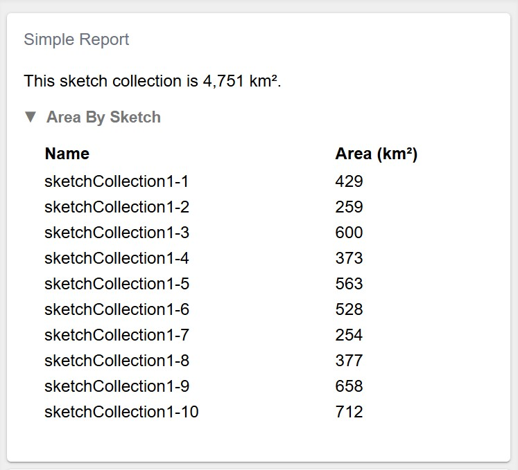

### First Project Build

Now that you have confirmed your function is working properly, and your report client displays properly for a variety of example sketches, you are ready to do your first build. The application `build` proceess packages it for deployment. Specifically it:

- Checks all the Typescript code to make sure it's valid and types are used properly.
- Transpiles all Typescript to Javascript
- Bundles UI report clients into the `.build-web` directory
- Bundles geoprocessing and preprocessing functions into the `.build` directory.

To build your application run the following:

```bash
npm run build
```

Once your build is successful, you should stage and commit all your changes to git.

## Reef Report

Next you will create a coral reef report that uses the reef extent dataset. Here is an image of it displayed in QGIS. Notice that the coral is entirely in shallow water around the island coastline and atolls.

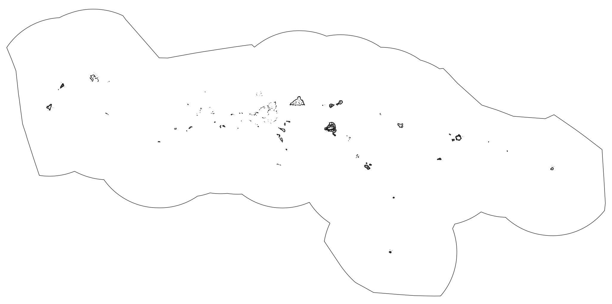

### Import Data

To access this datasource, first download a data package prepared for FSM to your project space and unzip it:

```bash
wget -P data/src https://github.com/user-attachments/files/18030075/FSM_MSP_Data_Example_v2.zip
unzip data/src/FSM_MSP_Data_Example_v2.zip -d data/src
rm data/src/FSM_MSP_Data_Example_v2.zip
```

Now import the datasource to your project.

```bash
npm run import:data
```

```text
? Type of data?
Vector
? Enter path to src file (with filename)
data/src/reefextent.fgb
? Select layer to import
reefextent
? Choose unique datasource name (a-z, A-Z, 0-9, -, _), defaults to filename
reefextent
? Should multi-part geometries be split into single-part geometries?
Yes
? (Optional) additional formats to create (besides fgb)
[Press enter to skip]
? Select feature properties that you want to group metrics by
[Press enter to skip]
? Select additional feature properties to keep in final datasource
[Press enter to skip]
? These formats are automatically created: fgb. Select any additional formats you want created
[Press enter to skip]
? Will you be precalculating summary metrics for this datasource after import? (Typically yes if reporting sketch % overlap with datasource)
Yes
```

The import process will:

- reproject your data to the WGS84 reference system, if not already (required by Turf.JS)
- split any features that cross the 180 degree [antimeridian](../antimeridian/Antimeridian.md)
- reduce the source dataset down to only the necessary attributes (saving network bandwidth later)
- output a new file in the cloud-optimized flatgeobuf format to the `data/dist` directory.
- register the datasource in `project/datasources.json`, along with additional metadata. This allows you to:
  - quickly access project datasources in your reports using the `projectClient` (more on this later)
  - quickly reimport datasources using the `reimport:data` command, without having to answer questions again.

Once the import is finished, you are ready to use your datasources for `local` report development. You can add, edit, or delete records in datasources.json manually to meet your need as long as the records meet the expected [schema](../concepts/Concepts.md#datasources).

### Precalc Data

Next, you will create a standalone script to calculate the total area of the polygons in the reef extent datasource for use in the report. By doing this calculation ahead of time, you won't need to do it every time your geoprocessing function runs. There is an automated way of precalculating the area of a datasource, but the purpose of this is to teach you a workflow for doing it on your own.

Create a new file with the following code and save it to `scripts/coralReefPrecalc.ts`:

```typescript
// Run the following command from the project root directory
// npx tsx scripts/coralReefPrecalc.ts

import { area } from "@turf/turf";
import { geojson } from "flatgeobuf";
import { readFileSync } from "fs";
import fs from "fs-extra";

// Fetch all reef features and calculate total area
const buffer = readFileSync(
  `${import.meta.dirname}/../data/dist/reefextent.fgb`,
);
const reefFeatures = geojson.deserialize(new Uint8Array(buffer));
const totalArea = area(reefFeatures);

const reefPrecalc = {
  totalAreaSqMeters: totalArea,
};

fs.ensureDirSync(`${import.meta.dirname}/../data/precalc`);
fs.writeJsonSync(
  `${import.meta.dirname}/../data/precalc/reefextent.json`,
  reefPrecalc,
);
```

Now run it. Your shell needs to be in the root directory of your project to run this Typescript file directly using `npx`:

```bash
npx tsx scripts/coralReefPrecalc.ts
```

The script fetches all features from the reef extent flatgeobuf file, calculates their total area and writes it to `data/precalc/reefextent.json`.

```text
{
  "totalArea": 716100906.2570591
}
```

We are going to use this precalculated value in a geoprocessing function in the next step.

### Create Report

To create a blank report ready to build on, run the following:

```bash
npm run create:report
```

```text
? Type of report to create
Blank report - empty report ready to build from scratch

? Describe what this reports geoprocessing function will calculate (e.g. Calculate sketch overlap with boundary polygons)
Calculate sketch overlap with reef extent datasource

? Title for this report, in camelCase
coralReef

✔ Created coralReef report
✔ Registered report assets in project/geoprocessing.json

Geoprocessing function: src/functions/coralReef.ts
Smoke test: src/functions/coralReefSmoke.test.ts
Report component: src/components/CoralReefCard.tsx
Story generator: src/components/CoralReefCard.example-stories.ts

Next Steps:
    * 'npm test' to run smoke tests against your new geoprocessing function
    * 'npm run storybook' to view your new report with smoke test output
    * Add <CoralReefCard /> to a top-level report client or page when ready
```

Open `src/functions/coralReef.ts`.

You will now update this code to answer the following questions:

- What percentage of all coral reef is within the current sketch polygon (or sketch collection polygons)?
- If it is a sketch collection, does it meet the planning objective of protecting 20% of all coral reef?

Replace the existing code with the following:

<details>
<summary>src/functions/coralReef.ts</summary>

```typescript
import {
  Sketch,
  SketchCollection,
  Polygon,
  MultiPolygon,
  GeoprocessingHandler,
  getFeaturesForSketchBBoxes,
  toSketchArray,
  clipMultiMerge,
  isSketchCollection,
  clip,
  Feature,
} from "@seasketch/geoprocessing";
import project from "../../project/projectClient.js";
import { area, featureCollection } from "@turf/turf";
import reefPrecalc from "../../data/precalc/reefextent.json";

export interface CoralReefResults {
  /** area of all reef extent polygons in square meters */
  totalArea: number;
  /** area of reef extent within sketch or sketch collection in square meters */
  sketchArea: number;
  childSketchAreas: {
    /** Name of the sketch */
    name: string;
    /** Area of reef extent within child sketch in square meters */
    area: number | null;
  }[];
}

/**
 * Simple geoprocessing function with custom result payload
 */
export async function coralReef(
  sketch:
    | Sketch<Polygon | MultiPolygon>
    | SketchCollection<Polygon | MultiPolygon>,
): Promise<CoralReefResults> {
  // Load just the reef features that intersect with the sketch bounding box
  // or in case of a sketch collection, the child sketch bounding boxes
  const ds = project.getInternalVectorDatasourceById("reefextent");
  const url = project.getDatasourceUrl(ds);
  const reefFeatures = await getFeaturesForSketchBBoxes(sketch, url);

  // Add analysis code

  // If collection, calculate area of each sketches intersection with reef
  let childSketchAreas: CoralReefResults["childSketchAreas"] = [];
  if (sketch.properties.isCollection) {
    childSketchAreas = toSketchArray(sketch).map((sketch) => {
      const sketchReefOverlap = clipMultiMerge(
        sketch,
        featureCollection(reefFeatures),
        "intersection",
      );
      return {
        name: sketch.properties.name,
        area: sketchReefOverlap ? area(sketchReefOverlap) : 0,
      };
    });
  }

  // Calculate area of overall sketch intersection with reef
  const sketchArea = (() => {
    // Figure out feature to clip
    let clipFeature: Feature<Polygon | MultiPolygon> | null;
    if (reefFeatures.length === 0) {
      return 0;
    } else if (isSketchCollection(sketch)) {
      // union sketches to remove overlap and avoid double count
      clipFeature = clip(sketch, "union");
      if (!clipFeature) return 0;
    } else {
      clipFeature = sketch;
    }
    //Merge reefFeatures into a single multipolygon, then intersect
    const sketchReefOverlap = clipMultiMerge(
      clipFeature,
      featureCollection(reefFeatures),
      "intersection",
    );
    return sketchReefOverlap ? area(sketchReefOverlap) : 0;
  })();

  // Custom return type
  return {
    totalArea: reefPrecalc.totalAreaSqMeters,
    sketchArea: sketchArea,
    childSketchAreas,
  };
}

export default new GeoprocessingHandler(coralReef, {
  title: "coralReef",
  description: "calculate sketch overlap with reef extent datasource",
  timeout: 60, // seconds
  memory: 1024, // megabytes
  executionMode: "async",
});
```

</details>

Notice that the code imports the totalArea value you precalculated and inserts it into the result payload, avoiding the need to recalculate it each time.

```typescript
import reefPrecalc from "../../data/precalc/reefextent.json";

reefPrecalc.totalArea;
```

Then it fetches only the reef features whose bounding box intersects with the sketch bounding box, or in case of a sketch collection, that intersects with each of its child sketch bounding boxes. This is more efficient than fetching the entire reef dataset, saving time and network bandwidth.

```typescript
// Load just the reef features that intersect with the sketch bounding box
// or in case of a sketch collection, the child sketch bounding boxes
const ds = project.getInternalVectorDatasourceById("reefextent");
const url = project.getDatasourceUrl(ds);
const reefFeatures = await getFeaturesForSketchBBoxes(sketch, url);
```

Next, if the sketch is a collection, it calculates how much coral reef overlaps with each individual sketch. To do this, it needs to figure out the areas where the sketches and coral reef `intersect`. This is calculated using the `clipMultiMerge` function. It is essential that this function is used because it merges the reefFeatures collection into a single multipolygon before intersecting it with the sketch. If you were to use the `clip` function you would need to loop through each reef feature and clip the sketch to it.

```typescript
// If collection, calculate area of each sketches intersection with reef
let childSketchAreas: CoralReefResults["childSketchAreas"] = [];
if (sketch.properties.isCollection) {
  childSketchAreas = toSketchArray(sketch).map((sketch) => {
    const sketchReefOverlap = clipMultiMerge(
      sketch,
      featureCollection(reefFeatures),
      "intersection",
    );
    return {
      name: sketch.properties.name,
      area: sketchReefOverlap ? area(sketchReefOverlap) : 0,
    };
  });
}
```

Finally, it calculates how much coral reef overlaps with the entire sketch/collection.

- If there is no overlap between the reef and sketch, then it simply returns zero.
- If it's a sketch collection it first performs a `union` operation that merges all of the sketches into a single Multipolygon, dissolving any overlap between the sketches so that area is not double counted.
- If it's a single sketch polygon then it just calculates its area and returns it.

```typescript
// Calculate area of overall sketch intersection with reef
const sketchArea = (() => {
  // Figure out feature to clip
  let clipFeature: Feature<Polygon | MultiPolygon> | null;
  if (reefFeatures.length === 0) {
    return 0;
  } else if (isSketchCollection(sketch)) {
    // union sketches to remove overlap and avoid double count
    clipFeature = clip(sketch, "union");
    if (!clipFeature) return 0;
  } else {
    clipFeature = sketch;
  }
  //Merge reefFeatures into a single multipolygon, then intersect
  const sketchReefOverlap = clipMultiMerge(
    clipFeature,
    featureCollection(reefFeatures),
    "intersection",
  );
  return sketchReefOverlap ? area(sketchReefOverlap) : 0;
})();

// Custom return type
return {
  totalArea: reefPrecalc.totalAreaSqMeters,
  sketchArea: sketchArea,
  childSketchAreas,
};
```

Now run tests to generate updated output for each of the sample sketches:

```bash
npm run test
```

Confirm that the output looks as expected.

<details>
<summary>Example sketch collection output</summary>

```text
{
  "totalArea": 716100906.2570591,
  "sketchArea": 367734.86730626615,
  "childSketchAreas": [
    {
      "name": "sketchCollection1-1",
      "area": 428611581.5348215
    },
    {
      "name": "sketchCollection1-2",
      "area": 258701691.8012635
    },
    {
      "name": "sketchCollection1-3",
      "area": 599831752.2377243
    },
    {
      "name": "sketchCollection1-4",
      "area": 372585470.74404347
    },
    {
      "name": "sketchCollection1-5",
      "area": 562781719.588172
    },
    {
      "name": "sketchCollection1-6",
      "area": 528237794.83984125
    },
    {
      "name": "sketchCollection1-7",
      "area": 253970548.59694752
    },
    {
      "name": "sketchCollection1-8",
      "area": 376674659.1741572
    },
    {
      "name": "sketchCollection1-9",
      "area": 657788539.6501052
    },
    {
      "name": "sketchCollection1-10",
      "area": 712233449.0549812
    }
  ]
}
```

</details>

Now open src/components/CoralReefCard.tsx.

You will now update this code to:

- Display the % of total coral reef captured within this sketch
- If it is a sketch collection
  - Indicate whether the objective of protecting 20% of all coral reef has been met.
  - Display a collapsible area with a breakdown of the area and % area of coral reef within each individual sketch in the collection.

Replace the existing code with the following:

<details>
<summary>src/components/CoralReefCard.tsx</summary>

```javascript
import React from "react";
import { Trans, useTranslation } from "react-i18next";
import {
  ResultsCard,
  useSketchProperties,
  HorizontalStackedBar,
  Collapse,
  Table,
  ObjectiveStatus,
  VerticalSpacer,
} from "@seasketch/geoprocessing/client-ui";
import {
  percentWithEdge,
  roundDecimalFormat,
  squareMeterToKilometer,
} from "@seasketch/geoprocessing/client-core";

// Import CoralReefResults to type-check data access in ResultsCard render function
import { CoralReefResults } from "../functions/coralReef.js";

export const CoralReefCard = () => {
  const { t } = useTranslation();
  const [{ isCollection }] = useSketchProperties();
  const titleTrans = t("CoralReefCard title", "Coral Reef");
  return (
    <>
      <ResultsCard title={titleTrans} functionName="coralReef">
        {(data: CoralReefResults) => {
          const target = 0.2; // 20%
          const reefPerc = data.sketchArea / data.totalArea;
          const reefPercString = percentWithEdge(reefPerc);
          const targetPercString = percentWithEdge(target);

          const meetsObjective = reefPerc >= target;

          // Adjust values for chart to be in range 0-100
          const chartRows = [[[reefPerc * 100]]];

          const sketchTypeStr = isCollection
            ? t("sketch collection")
            : t("sketch");

          const meetsOrNotElement = meetsObjective ? (
            <Trans i18nKey="CoralReefCard meets objective message">
              This {{ sketchTypeStr }} meets the objective of protecting{" "}
              {{ targetPercString }} of coral reef
            </Trans>
          ) : (
            <Trans i18nKey="CoralReefCard does not meet objective message">
              This {{ sketchTypeStr }} does not meet the objective of protecting{" "}
              {{ targetPercString }} of coral reef
            </Trans>
          );

          return (
            <>
              <p>
                <Trans i18nKey="CoralReefCard reef size message">
                  {{ reefPercString }} of all Micronesia coral reef is within
                  this {{ sketchTypeStr }}.
                </Trans>
              </p>
              {isCollection && (
                <ObjectiveStatus
                  status={meetsObjective ? "yes" : "no"}
                  msg={meetsOrNotElement}
                />
              )}

              <VerticalSpacer />
              <HorizontalStackedBar
                rows={chartRows}
                valueFormatter={(value) => percentWithEdge(value / 100)}
                max={4}
                target={20}
                targetValueFormatter={(targetValue) => (
                  <Trans i18nKey="CoralReefCard target label">
                    Target {{ targetValue: percentWithEdge(targetValue / 100) }}
                  </Trans>
                )}
                rowConfigs={[
                  {
                    title: t("Total coral reef"),
                  },
                ]}
                blockGroupNames={[]}
                blockGroupStyles={[{ backgroundColor: "#64c2a6" }]}
              />
              {isCollection && (
                <Collapse title={t("Show By Sketch")}>
                  <Table
                    data={data.childSketchAreas}
                    columns={[
                      {
                        Header: t("Name"),
                        accessor: "name",
                      },
                      {
                        Header: t("Reef within Sketch (km²)"),
                        accessor: (row: any) =>
                          roundDecimalFormat(squareMeterToKilometer(row.area)),
                      },
                      {
                        Header: t("% Reef within Sketch"),
                        accessor: (row: any) =>
                          percentWithEdge(row.area / data.totalArea),
                      },
                    ]}
                  />
                </Collapse>
              )}
            </>
          );
        }}
      </ResultsCard>
    </>
  );
};
```

</details>

There are multiple things worth noticing:

- `squareMeterToKilometer` conversion helper function is used
- `percentWithEdge` and `roundDecimalFormat` helper functions are used to format values to be more human readable. Will use locale settings of the users browser when formatting decimal and percent.
- `HorizontalStackedBar` and `ObjectiveStatus` core UI components present information in a more visually interesting way that can be reused across reports. See core [storybook](/storybook) for more examples of their use.

Now, start storybook and view the result:

```bash
npm run storybook
```

When viewing a sketch example, it should display the following:

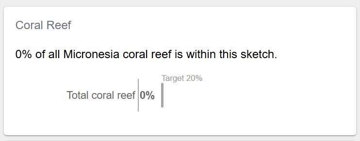

Keep in mind your sketch polygon examples are randomly generated so your numbers will vary thw ones shown.

And when viewing a sketch collection example, it should display the additional "Show By Sketch" list:

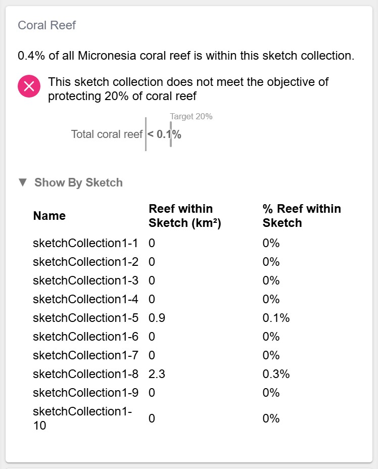

### Add to Tab Report

Now add the CoralReefCard to a new page in your top-level TabReport.

Open `src/clients/TabReport.tsx` and replace the code with the following:

<details>
<summary>src/clients/TabReport.tsx</summary>

```javascript
import React, { useState } from "react";
import { useTranslation } from "react-i18next";
import {
  SegmentControl,
  ReportPage,
  SketchAttributesCard,
} from "@seasketch/geoprocessing/client-ui";
import Translator from "../components/TranslatorAsync.js";
import { SimpleCard } from "../components/SimpleCard.js";
import { CoralReefCard } from "../components/CoralReefCard.js";

const BaseReport = () => {
  const { t } = useTranslation();
  const segments = [
    { id: "OVERVIEW", label: t("Overview") },
    { id: "BIOLOGICAL", label: t("Biological") },
  ];
  const [tab, setTab] = useState < string > "OVERVIEW";

  return (
    <>
      <div style={{ marginTop: 5 }}>
        <SegmentControl
          value={tab}
          onClick={(segment) => setTab(segment)}
          segments={segments}
        />
      </div>
      <ReportPage hidden={tab !== "OVERVIEW"}>
        <SimpleCard />
        <SketchAttributesCard autoHide />
      </ReportPage>
      <ReportPage hidden={tab !== "BIOLOGICAL"}>
        <CoralReefCard />
      </ReportPage>
    </>
  );
};

// Named export loaded by storybook
export const TabReport = () => {
  return (
    <Translator>
      <BaseReport />
    </Translator>
  );
};

// Default export lazy-loaded by production ReportApp
export default TabReport;
```

</details>

Storybook should update on save and display the following:

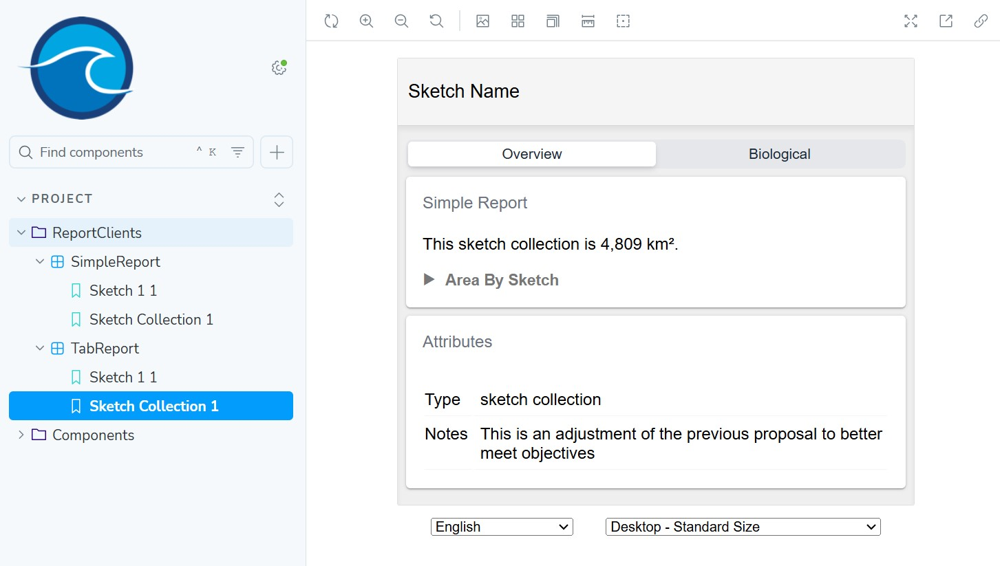

You should be able to click the tabs and switch between report pages.

## Benthic Habitat Report

Next you will create a report summarizing sketch overlap with 3 classes of rocky substrate (rock, rubble, sand) in the benthic zone (seabottom). Here is an image of it displayed in QGIS within the Micronesian EEZ boundary. Similar to the coral reefs, notice that these 3 types of rocky seabottom are mostly in shallower water near the islands and atolls.

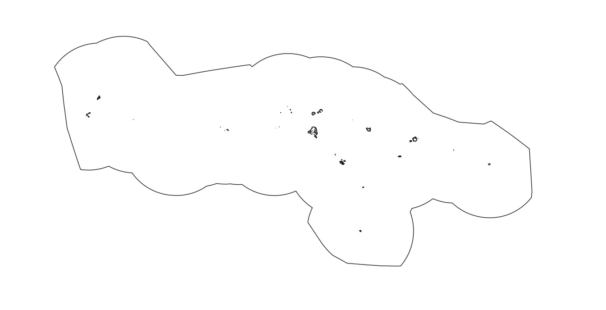

### Import Data

First, import the data.

```bash
npm run import:data
```

```text
? Type of data?
Vector
? Enter path to src file (with filename)
data/src/benthic-rock.fgb
? Select layer to import
benthic-rock
? Choose unique datasource name (a-z, A-Z, 0-9, -, _), defaults to filename
benthic-rock
? Should multi-part geometries be split into single-part geometries?
Yes
? (Optional) additional formats to create (besides fgb)
[Press Enter to skip]
? Select feature properties that you want to group metrics by
class
? Select additional feature properties to keep in final datasource
[Press Enter to skip]

Adding benthic-rock record in project/datasources.json file
```

### Precalc Data

Before you can use your benthic report, you need to precalculate the area of your benthic polygons. Rather than writing your own script for this, the `precalc:data` command is available that will inspect your vector datasources and precalculate basic summary metrics (total feature area, total feature count, etc). Let's look at the datasource record generated for our benthic-rock datasource to understand what precalc will do.

<details>
<summary>project/datasources.json</summary>

```typescript
{
  "src": "data/src/benthic-rock.fgb",
  "layerName": "benthic-rock",
  "geo_type": "vector",
  "datasourceId": "benthic-rock",
  "formats": [
    "fgb"
  ],
  "classKeys": [
    "class"
  ],
  "created": "2024-11-28T05:58:26.284Z",
  "lastUpdated": "2024-11-28T05:58:26.284Z",
  "propertiesToKeep": [
    "class"
  ],
  "explodeMulti": true,
  "precalc": true
}
```

</details>

You'll notice that the `precalc` property is set to true. That means that it is made available for precalculation. You can disable precalculation for any datasource you want at any time by setting it to `false`.

You'll also notice that the `class` attribute is configured under `classKeys`.

```json
"classKeys": [
  "class"
],
```

This is because when importing your datasource, when asked to select feature properties that you want to group metrics by, you selected `class`. If present, the precalc command will use this to precalculate metrics by each unique value present in the dataset for the `class` attribute. If not present, you can simply add it now and save your file.

You're now ready to precalculate your metrics.

```bash
npm run precalc:data

? Do you want to precalculate only a subset?
No, just precalculate everything (may take a while)

...

2 datasource/geography combinations precalculated successfully
2 datasource/geography combinations skipped due to precalc disabled
```

You should now have precalculated `area` and `count` metrics for both reefextent and benthic-rock datasources. Let's look closer at the output.

<details>
<summary>project/precalc.json</summary>

```json
[
  {
    "geographyId": "world",
    "metricId": "area",
    "classId": "benthic-rock-Rock",
    "sketchId": null,
    "groupId": null,
    "value": 16604057.106034255
  },
  {
    "geographyId": "world",
    "metricId": "area",
    "classId": "benthic-rock-Rubble",
    "sketchId": null,
    "groupId": null,
    "value": 14568314.003883593
  },
  {
    "geographyId": "world",
    "metricId": "area",
    "classId": "benthic-rock-Sand",
    "sketchId": null,
    "groupId": null,
    "value": 41378302.21403051
  },
  {
    "geographyId": "world",
    "metricId": "area",
    "classId": "benthic-rock-total",
    "sketchId": null,
    "groupId": null,
    "value": 72550673.32394843
  },
  {
    "geographyId": "world",
    "metricId": "area",
    "classId": "reefextent-total",
    "sketchId": null,
    "groupId": null,
    "value": 716231422.607066
  },
  {
    "geographyId": "world",
    "metricId": "count",
    "classId": "benthic-rock-Rock",
    "sketchId": null,
    "groupId": null,
    "value": 2712
  },
  {
    "geographyId": "world",
    "metricId": "count",
    "classId": "benthic-rock-Rubble",
    "sketchId": null,
    "groupId": null,
    "value": 2002
  },
  {
    "geographyId": "world",
    "metricId": "count",
    "classId": "benthic-rock-Sand",
    "sketchId": null,
    "groupId": null,
    "value": 2658
  },
  {
    "geographyId": "world",
    "metricId": "count",
    "classId": "benthic-rock-total",
    "sketchId": null,
    "groupId": null,
    "value": 7372
  },
  {
    "geographyId": "world",
    "metricId": "count",
    "classId": "reefextent-total",
    "sketchId": null,
    "groupId": null,
    "value": 14406
  }
]
```

</details>

Within this array of precalc metric records you will see four that represent the total area of all benthic-rock polygons and the total area for each of the 3 benthic rock classes:

```json
{
  "geographyId": "world",
  "metricId": "area",
  "classId": "benthic-rock-total",
  "sketchId": null,
  "groupId": null,
  "value": 72550673.32394843
},
{
  "geographyId": "world",
  "metricId": "area",
  "classId": "benthic-rock-Rock",
  "sketchId": null,
  "groupId": null,
  "value": 16604057.106034255
},
{
  "geographyId": "world",
  "metricId": "area",
  "classId": "benthic-rock-Rubble",
  "sketchId": null,
  "groupId": null,
  "value": 14568314.003883593
},
{
  "geographyId": "world",
  "metricId": "area",
  "classId": "benthic-rock-Sand",
  "sketchId": null,
  "groupId": null,
  "value": 41378302.21403051
}
```

These will get loaded and used by the BenthicReefCard as the denominator value when calculating percent sketch overlap.

:::note

If at any point the process of using `import:data`, `precalc:data` or the `projectClient` don't meet your needs, you are welcome to create your own separate workflow. As long as datasources get to the `data/dist` directory for publishing, in the format (fgb, cog) and projection required (EPSG 4326 for vector, EPSG 6933 for raster) you can create your own solution.

:::

### World Geography

You might have noticed in the precalculated metrics that they are assigned a geographyId of `world`. `Geographies` are a higher level feature of the framework that define polygon boundaries that serve a specfic purpose in your project. The main use case is to define planning boundaries for your project, if you have them.

The default Geography for a new project is the `world` geography, which establishes the entire world as your planning boundary. This is sufficient for your needs until you have a more specific planning boundary that you want to work with. For example you can clip your sketches and your data to a geography in order to report metrics for a specific geography. Since your data is already pre-clipped to the planning area, and there is only one planning area, you don't need to do anything more with this feature. You can just leave it to use the `world` geography.

Geographies are defined in `project/geographies.json`. To learn more visit the [advanced concepts](../concepts/Concepts.md#geographies) page.

### Add Metric Group

A metric group is a higher-level entity that defines a metric to be measured, for one or more classes of data. `MetricGroup` **records** can defined in `project/metrics.json` and accessed using the project client in your geoprocessing functions and reports.

Let's create a metric group by first looking at the benthic dataset. It represents where multiple classes of benthic habitat are present - sand, rock, rubble. Each polygon is assigned with a single habitat type using the `class` attribute and given a value of `Sand`, `Rock`, or `Rubble`.

Add the following metric group object to `project/metrics.json` and save the file.

```json
{
  "metricId": "benthicHabitat",
  "classKey": "class",
  "datasourceId": "benthic-rock",
  "classes": [
    {
      "classId": "Sand",
      "display": "Sand"
    },
    {
      "classId": "Rock",
      "display": "Rock"
    },
    {
      "classId": "Rubble",
      "display": "Rubble"
    }
  ]
}
```

This defines a `benthicHabitat` metric that sources data from the `benthic` datasource. The `classKey` indicates this datasource has an attribute named `class` used to identify which data class each polygon is a member of. 3 data classes are defined with a `classId` serving as the unique identifier for the data class, and it also matches the value used in the data at the `classKey` attribute.

To learn more about metric groups, visit the [advanced concepts](../concepts/Concepts.md#metric-group) page.

### Create Report

Next you will create a report that uses your metric group. Run the following command and answer the questions:

```bash
npm run create:report
```

```text
? Type of report to create
Vector overlap report - calculates sketch overlap with vector datasources
? Describe what this reports geoprocessing function will calculate (e.g. Calculate sketch overlap with boundary polygons)
Calculate sketch overlap with benthic habitat
? Select the metric group to report on
benthicHabitat

✔ Created benthicHabitat report
✔ Registered report assets in project/geoprocessing.json

Geoprocessing function: src/functions/benthicHabitat.ts
Smoke test: src/functions/benthicHabitatSmoke.test.ts
Report component: src/components/BenthicHabitatCard.tsx
Story generator: src/components/BenthicHabitatCard.example-stories.ts

Next Steps:
    * 'npm test' to run smoke tests against your new geoprocessing function
    * 'npm run storybook' to view your new report with smoke test output
    * Add <BenthicHabitatCard /> to a top-level report client or page when ready
```

You should now have a geoprocessing function and card component ready to go that will iterate through your data classes and calculate/report area overlap with your sketch.

### Test New Example Sketch

Now run `npm run test` again look at the new smoke test output for your geoprocessing function in `examples/output`.

It's very likely that none of your random sketchs overlapped with any benthic polygons and all display zero. Add the following example sketch that we know will overlap.

<details>
<summary>examples/sketches/sketch2.json</summary>

```json
{
  "type": "Feature",
  "properties": {
    "id": "78f6e916-20f0-471e-a15e-6d632650cf68",
    "isCollection": false,
    "userAttributes": [
      {
        "label": "Type",
        "fieldType": "ChoiceField",
        "exportId": "TYPE",
        "value": "sketch"
      },
      {
        "label": "Notes",
        "value": "NOTES",
        "fieldType": "TextArea"
      }
    ],
    "sketchClassId": "3ac026ad-c3eb-471a-b6ad-58782aa5e949",
    "createdAt": "2024-11-26T02:48:33.985Z",
    "updatedAt": "2024-11-26T02:48:33.985Z",
    "name": "sketch2"
  },
  "geometry": {
    "type": "Polygon",
    "coordinates": [
      [
        [151.31665625673213, 7.749571426060996],
        [151.31665625673213, 5.925462431466443],
        [153.9861009666032, 5.925462431466443],
        [153.9861009666032, 7.749571426060996],
        [151.31665625673213, 7.749571426060996]
      ]
    ]
  },
  "id": "78f6e916-20f0-471e-a15e-6d632650cf68"
}
```

</details>

Now `npm run test` and you should now see non-zero output for each benthic class for the sketch2 example:

<details>
<summary>examples/output/sketch2/benthicHabitat.json</summary>

```json
{
  "metrics": [
    {
      "geographyId": "world",
      "metricId": "benthicHabitat",
      "classId": "Rock",
      "sketchId": "78f6e916-20f0-471e-a15e-6d632650cf68",
      "groupId": null,
      "value": 11210186.968081,
      "extra": {
        "sketchName": "sketch2"
      }
    },
    {
      "geographyId": "world",
      "metricId": "benthicHabitat",
      "classId": "Rubble",
      "sketchId": "78f6e916-20f0-471e-a15e-6d632650cf68",
      "groupId": null,
      "value": 11210186.968081,
      "extra": {
        "sketchName": "sketch2"
      }
    },
    {
      "geographyId": "world",
      "metricId": "benthicHabitat",
      "classId": "Sand",
      "sketchId": "78f6e916-20f0-471e-a15e-6d632650cf68",
      "groupId": null,
      "value": 11210186.968081,
      "extra": {
        "sketchName": "sketch2"
      }
    }
  ]
}
```

</details>

### Add To Tab Report

Next, add BenthicHabitatCard to a new **Habitat** page in TabReport. Open `src/clients/TabReport.tsx` and replace the code with the following:

<details>
<summary>src/clients/TabReport.tsx</summary>

```javascript
import React, { useState } from "react";
import { useTranslation } from "react-i18next";
import {
  SegmentControl,
  ReportPage,
  SketchAttributesCard,
} from "@seasketch/geoprocessing/client-ui";
import Translator from "../components/TranslatorAsync.js";
import { SimpleCard } from "../components/SimpleCard.js";
import { CoralReefCard } from "../components/CoralReefCard.js";
import { BenthicHabitatCard } from "../components/BenthicHabitatCard.js";

const BaseReport = () => {
  const { t } = useTranslation();
  const segments = [
    { id: "OVERVIEW", label: t("Overview") },
    { id: "BIOLOGICAL", label: t("Biological") },
    { id: "HABITAT", label: t("Habitat") },
  ];
  const [tab, setTab] = useState < string > "OVERVIEW";

  return (
    <>
      <div style={{ marginTop: 5 }}>
        <SegmentControl
          value={tab}
          onClick={(segment) => setTab(segment)}
          segments={segments}
        />
      </div>
      <ReportPage hidden={tab !== "OVERVIEW"}>
        <SimpleCard />
        <SketchAttributesCard autoHide />
      </ReportPage>
      <ReportPage hidden={tab !== "BIOLOGICAL"}>
        <CoralReefCard />
      </ReportPage>
      <ReportPage hidden={tab !== "HABITAT"}>
        <BenthicHabitatCard />
      </ReportPage>
    </>
  );
};

// Named export loaded by storybook
export const TabReport = () => {
  return (
    <Translator>
      <BaseReport />
    </Translator>
  );
};

// Default export lazy-loaded by production ReportApp
export default TabReport;
```

</details>

Storybook should update on save and display the following:

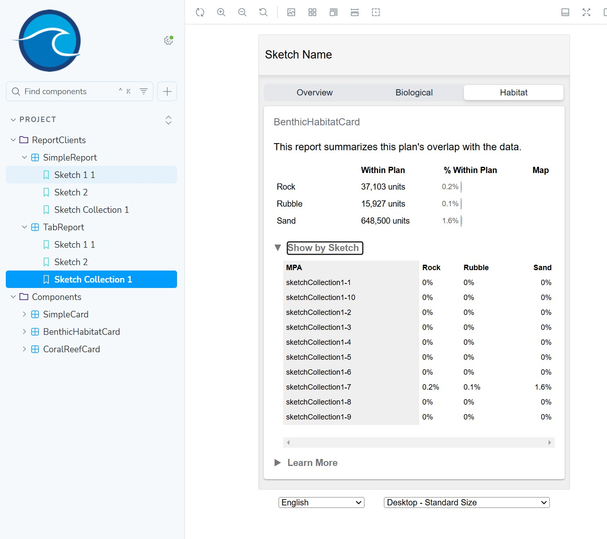

## Seamount Report

Next you will create a report summarizing sketch overlap with areas that are within 40k kilometers of a seamount, which is an underwater mountain that rises at least 1,000 meters above the surrounding ocean. Here is an image of these areas displayed in QGIS within the Micronesian EEZ boundary.

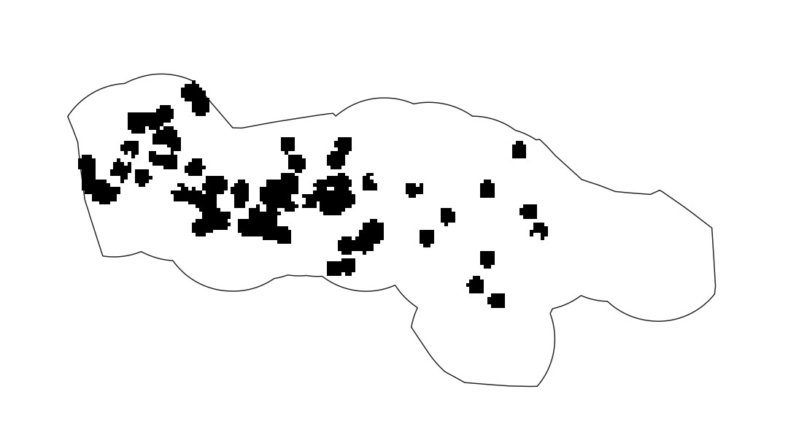

The seamount dataset is in a raster format. It is a binary raster such that each raster cell has a value of zero or one. Rasters are like digital images, in that each pixel or cell represents a specific rectangular area of the world and gives it a value. This particular dataset is a binary raster. Each cell has a value of zero or one. A one value indicates that the cell is within 40 kilemeters of a seamount, a zero value indicates it is not.

### Import Data

Next you will import this seamount raster:

```bash
npm run import:data

? Type of data?
Raster

? Enter path to src file (with filename)
data/src/seamounts_40km.tif

? Choose unique datasource name (a-z, A-Z, 0-9, -, _), defaults to filename
seamounts_40km

? Select raster band to import
1

? What type of measurement is used for this raster data?
Quantitative - cell value (number) represents a measurement of a single thing

Adding seamounts_40km record in project/datasources.json file
```

### Precalc Data

Now, precalculating metrics for a cloud-optimized geotiff raster is a little more complicated than for a flatgeobuf. For this reason, we want to make use of the built-in `precalc` feature. Run the precalc command as follow:

```bash
npm run precalc:data

? Do you want to precalculate only a subset?
Yes, by datasource

? Which datasources do you want to precalculate? (will precalculate for all geographies)
Let me choose

? What datasources would you like to precalculate? (select as many as you want)
seamounts_40km - raster

Precalculating datasource seamounts_40km for geography world
1 datasource/geography combinations precalculated successfully
```

Now look at project/precalc.json. You should see 4 new precalculated metrics for octocorals:

- `valid` - count of all raster cells with value (not nodata cells)
- `count` - count of all cells in the raster, both valid and invalid (nodata)
- `sum` - sum of value of all valid cell values in raster
- `area` - area of valid cells in raster in square meters

```json
  {
    "geographyId": "world",
    "metricId": "area",
    "classId": "seamounts_40km-total",
    "sketchId": null,
    "groupId": "band-0",
    "value": 400949272332.4638
  },
  {
    "geographyId": "world",
    "metricId": "count",
    "classId": "seamounts_40km-total",
    "sketchId": null,
    "groupId": "band-0",
    "value": 18748
  },
  {
    "geographyId": "world",
    "metricId": "sum",
    "classId": "seamounts_40km-total",
    "sketchId": null,
    "groupId": "band-0",
    "value": 1365
  },
  {
    "geographyId": "world",
    "metricId": "valid",
    "classId": "seamounts_40km-total",
    "sketchId": null,
    "groupId": "band-0",
    "value": 1365
  }
```

The area calculation is made possible by the fact that the raster is in an equal area projection, making all raster cells a consistent size. Area is calculated as:

- `area = raster cell width in meters x cell height in meters x number of valid cells

Notice that the precalculated `sum` and `valid` values are the same at `1365`. That is because the valid cells all have a value of 1 and the sum of the values in valid cells is the same as the count of valid cells.

### Add Objective

You will also use the built-in framework support for objectives. It allows you to configure a target value and measure progress toward it in a report. Open `project/objectives.json` and add the following objective:

```json
[
  {
    "objectiveId": "seamounts",
    "shortDesc": "Seamounts 30%",
    "target": 0.3,
    "countsToward": {}
  }
]
```

The `countsToward` property isn't necessary for this sample project but it allows you to indicate which of one or more categories count towards meeting the target. For example if you allow a user to assign a protection level to their sketch, you can allow only the two highest levels of protection to count toward meeting the target.

Example (do not add):

```json
{
  "countsToward": {
    "Full Protection": "yes",
    "High Protection": "yes",
    "Low Protection": "no"
  }
}
```

### Add Metric Group

The last bit of preparation is you will create a metric group. This will allow you to easily access your precalc metrics and your objective in your report card.

Create a seamount metric group that uses the objective in `project/metrics.json`.

```json
{
  "metricId": "seamounts",
  "datasourceId": "seamounts_40km",
  "classes": [
    {
      "classId": "seamounts",
      "display": "Seamounts",
      "objectiveId": "seamounts"
    }
  ]
}
```

### Create Report

Now create a blank seamount report

```text
npm run create:report

? Type of report to create
Blank report - empty report ready to build from scratch

? Describe what this reports geoprocessing function will calculate (e.g. Calculate sketch overlap with boundary polygons)
Calculate sketch overlap with seamount raster

? Title for this report, in camelCase
seamounts

✔ Created seamounts report
✔ Registered report assets in project/geoprocessing.json

Geoprocessing function: src/functions/seamounts.ts
Smoke test: src/functions/seamountsSmoke.test.ts
Report component: src/components/SeamountsCard.tsx
Story generator: src/components/SeamountsCard.example-stories.ts

Next Steps:
    * 'npm test' to run smoke tests against your new geoprocessing function
    * 'npm run storybook' to view your new report with smoke test output
    * Add <SeamountsCard /> to a top-level report client or page when ready
```

This creates both a geoprocessing function and report card, and registers them in `project/geoprocessing.json`.

Open `src/functions/seamounts.ts`.

You will now update this code answer the following questions:

- What percentage of area within 40 kilometers of a seamount is within the current sketch polygon (or sketch collection polygons)?
- If it is a sketch collection, does it meet the planning objective of protecting 30% of all area within 40 kilometers of a seamount?

Replace the existing code with the following:

<details>
<summary>src/functions/seamounts.ts</summary>

```typescript
import {
  Sketch,
  SketchCollection,
  Polygon,
  MultiPolygon,
  GeoprocessingHandler,
  DefaultExtraParams,
  loadCog,
  rasterStats,
  toSketchArray,
  StatsObject,
} from "@seasketch/geoprocessing";
import project from "../../project/projectClient.js";

export interface SeamountResult {
  /** Sum of valid seamount raster cells overlapping with sketch */
  stats: StatsObject[];
  childSketchStats: {
    /** Name of the sketch */
    name: string;
    /** Sum of valid seamount raster cells overlapping with sketch */
    stats: StatsObject[];
  }[];
}

/**
 * seamounts for use with create:report command
 */
export async function seamounts(
  sketch:
    | Sketch<Polygon | MultiPolygon>
    | SketchCollection<Polygon | MultiPolygon>,
  extraParams: DefaultExtraParams = {},
): Promise<SeamountResult> {
  const metricGroup = project.getMetricGroup("seamounts");
  const ds = project.getMetricGroupDatasource(metricGroup);
  const url = project.getDatasourceUrl(ds);
  const raster = await loadCog(url);

  // Add analysis code
  const stats = await rasterStats(raster, {
    feature: sketch,
    stats: ["sum"],
  });

  let childSketchStats: SeamountResult["childSketchStats"] = [];
  if (sketch.properties.isCollection) {
    childSketchStats = await Promise.all(
      toSketchArray(sketch).map(async (childSketch) => {
        const childStats = await rasterStats(raster, {
          feature: childSketch,
          stats: ["sum"],
        });
        return {
          name: childSketch.properties.name,
          stats: childStats,
        };
      }),
    );
  }

  // Custom return type
  return {
    stats,
    childSketchStats,
  };
}

export default new GeoprocessingHandler(seamounts, {
  title: "seamounts",
  description: "Calculate sketch overlap with seamount data",
  timeout: 60, // seconds
  memory: 1024, // megabytes
  executionMode: "async",
});
```

</details>

Notice the more sophisticated result payload. It's designed to return one or more raster stats for the top-level sketch, and one or more child sketch stats if it's a sketch collection. This gives the structure some room to grow if you want to produce multiple raster stats for each sketch and use them in this report.

```typescript
export interface SeamountResult {
  /** Sum of valid seamount raster cells overlapping with sketch */
  stats: StatsObject[];
  childSketchStats: {
    /** Name of the sketch */
    name: string;
    /** Sum of valid seamount raster cells overlapping with sketch */
    stats: StatsObject[];
  }[];
}
```

Then it fetches the metadata for the seamounts raster, ready to read data from it.

```typescript
const metricGroup = project.getMetricGroup("seamounts");
const ds = project.getMetricGroupDatasource(metricGroup);
const url = project.getDatasourceUrl(ds);
const raster = await loadCog(url);
```

Now let's look at the analysis code. If it's a sketch collection, sum the value of all rasters cells that overlap with each child sketch.

```typescript
// If sketch is collection, sum the value of raster cells that overlap with each child sketch
let childSketchStats: SeamountResult["childSketchStats"] = [];
if (sketch.properties.isCollection) {
  childSketchStats = await Promise.all(
    toSketchArray(sketch).map(async (childSketch) => {
      const childStats = await rasterStats(raster, {
        feature: childSketch,
        stats: ["sum"],
      });
      return {
        name: childSketch.properties.name,
        stats: childStats,
      };
    }),
  );
}
```

Next, sum the value of raster cells that overlap the entire top-level sketch or sketch collection and return the final result payload.

```typescript
// Calculate overall sketch area
const stats = await rasterStats(raster, {
  feature: sketch,
  stats: ["sum"],
});

// Custom return type
return {
  stats,
  childSketchStats,
};
```

If this is a sketch collection, you might notice that an optimization would be to sum the value of all the child sketches to get the overall sum for the whole collection. That is true, if your sketches are guaranteed not to overlap. In practice, sketches often can and do overlap in a planning process. The planning process may even allow it such as areas of higher protection within areas of lower protection. This is an optimization left to you.

Now run tests

```bash
npm test
```

Confirm that the output looks as expected.

<details>
<summary>Example sketch collection output</summary>

```text
{
  "stats": [
    {
      "sum": 5
    }
  ],
  "childSketchStats": [
    {
      "name": "sketchCollection1-1",
      "stats": [
        {
          "sum": 1
        }
      ]
    },
    {
      "name": "sketchCollection1-2",
      "stats": [
        {
          "sum": 1
        }
      ]
    },
    {
      "name": "sketchCollection1-3",
      "stats": [
        {
          "sum": 0
        }
      ]
    },
    {
      "name": "sketchCollection1-4",
      "stats": [
        {
          "sum": 0
        }
      ]
    },
    {
      "name": "sketchCollection1-5",
      "stats": [
        {
          "sum": 1
        }
      ]
    },
    {
      "name": "sketchCollection1-6",
      "stats": [
        {
          "sum": 0
        }
      ]
    },
    {
      "name": "sketchCollection1-7",
      "stats": [
        {
          "sum": 2
        }
      ]
    },
    {
      "name": "sketchCollection1-8",
      "stats": [
        {
          "sum": 0
        }
      ]
    },
    {
      "name": "sketchCollection1-9",
      "stats": [
        {
          "sum": 0
        }
      ]
    },
    {
      "name": "sketchCollection1-10",
      "stats": [
        {
          "sum": 0
        }
      ]
    }
  ]
}
```

</details>

Now, open src/components/SeamountsCard.tsx.

You will now update this code to:

- Display the % of total area within 40 kilometers of a seamount captured within this sketch
- If it is a sketch collection
  - Indicate whether the objective of protecting 30% of all area within 40 kilometers of a seamount has been met.
  - Display a collapsible area with a breakdown of the area and % area of seamount within each individual sketch in the collection.

Replace the existing code with the following:

<details>
<summary>src/components/SeamountCard.tsx</summary>

```javascript
import React from "react";
import { Trans, useTranslation } from "react-i18next";
import {
  Collapse,
  HorizontalStackedBar,
  ObjectiveStatus,
  ResultsCard,
  Table,
  useSketchProperties,
  VerticalSpacer,
} from "@seasketch/geoprocessing/client-ui";
import {
  percentWithEdge,
  roundDecimalFormat,
  squareMeterToKilometer,
} from "@seasketch/geoprocessing/client-core";
import project from "../../project/projectClient.js";
import { SeamountResult } from "../functions/seamounts.js";

export const SeamountsCard = () => {
  const { t } = useTranslation();
  const [{ isCollection }] = useSketchProperties();
  const titleTrans = t("SeamountCard title", "SeamountCard");

  // Get precalc total sum
  const curGeography = project.getGeographyById("world", {
    fallbackGroup: "default-boundary",
  });
  const metricGroup = project.getMetricGroup("seamounts", t);
  const precalcMetrics = project.getPrecalcMetrics(
    metricGroup,
    "sum",
    curGeography.geographyId,
  );
  const sumTotal = precalcMetrics[0].value;

  // Get objective target
  const target = project.getObjectiveById("seamounts").target;

  return (
    <>
      <ResultsCard title={titleTrans} functionName="seamounts">
        {(data: SeamountResult) => {
          console.log("precalc", precalcMetrics);
          console.log("data", data);

          const sumPerc = data.stats[0].sum! / sumTotal;
          const sumPercString = percentWithEdge(sumPerc);
          const targetPercString = percentWithEdge(target);

          const meetsObjective = sumPerc >= target;

          // Adjust values for chart to be in range 0-100
          const chartRows = [[[sumPerc * 100]]];

          const sketchStr = isCollection ? t("sketch collection") : t("sketch");

          const meetsOrNotElement = meetsObjective ? (
            <Trans i18nKey="SeamountsCard meets objective message">
              This {{ sketchStr }} meets the objective of protecting{" "}
              {{ targetPercString }} of area within 40 km of a seamount.
            </Trans>
          ) : (
            <Trans i18nKey="SeamountsCard does not meet objective message">
              This {{ sketchStr }} does not meet the objective of protecting{" "}
              {{ targetPercString }} of area within 40 km of a seamount.
            </Trans>
          );

          return (
            <>
              <p>
                <Trans i18nKey="SeamountsCard size message">
                  {{ sumPercString }} of all areas within 40 kilometers of a
                  seamount is within this {{ sketchStr }}.
                </Trans>
              </p>
              {isCollection && (
                <ObjectiveStatus
                  status={meetsObjective ? "yes" : "no"}
                  msg={meetsOrNotElement}
                />
              )}

              <VerticalSpacer />
              <HorizontalStackedBar
                rows={chartRows}
                valueFormatter={(value) => percentWithEdge(value / 100)}
                max={4}
                target={20}
                targetValueFormatter={(targetValue) => (
                  <Trans i18nKey="SeamountsCard target label">
                    Target {{ targetValue: percentWithEdge(targetValue / 100) }}
                  </Trans>
                )}
                rowConfigs={[
                  {
                    title: t("Total seamounts"),
                  },
                ]}
                blockGroupNames={[]}
                blockGroupStyles={[{ backgroundColor: "#64c2a6" }]}
              />
              {isCollection && (
                <Collapse title={t("Show By Sketch")}>
                  <Table
                    data={data.childSketchStats}
                    columns={[
                      {
                        Header: t("Name"),
                        accessor: "name",
                      },
                      {
                        Header: t("Seamount within Sketch (km²)"),
                        accessor: (row: any) =>
                          roundDecimalFormat(
                            squareMeterToKilometer(row.stats[0].sum),
                          ),
                      },
                      {
                        Header: t("% Seamount within Sketch"),
                        accessor: (row: any) =>
                          percentWithEdge(row.stats[0].sum / sumTotal),
                      },
                    ]}
                  />
                </Collapse>
              )}
            </>
          );
        }}
      </ResultsCard>
    </>
  );
};
```

</details>

There are multiple things worth noticing:

- the project client is getting more use, to access precalc metrics and the objective target.
- the code to access the result values is more complex than for the reef report, because the structure of the result data is more complex.

### Add To Tab Report

Next, add SeamountsCard to the **Habitat** page in TabReport. Open `src/clients/TabReport.tsx` and insert the following at the appropriate places:

<details>
<summary>src/clients/TabReport.tsx</summary>

```jsx
import { SeamountsCard } from "../components/SeamountsCard.js";

<ReportPage hidden={tab !== "HABITAT"}>
  <BenthicHabitatCard />
  <SeamountsCard />
</ReportPage>;
```

</details>

Storybook should update on save and display the following:

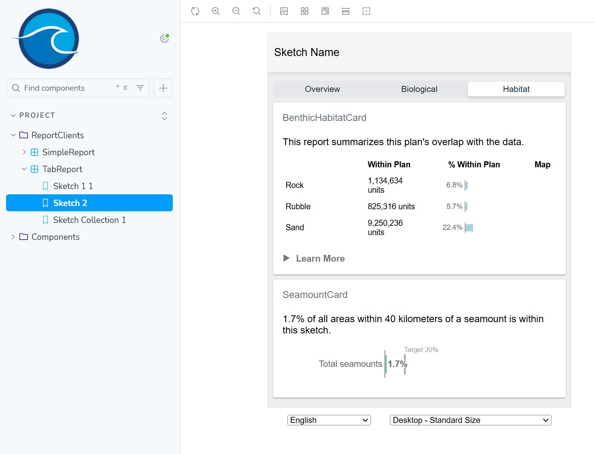

### Data Complexity

The rise in complexity of the results you started to see in the last report is something to be aware of. Imagine if a report needed to calculate a metric with 10 different classes of data. Now imagine each sketch is assigned to 1 of 4 different protection levels. Finally imagine the planning process is also split out into 3 different subregions. Now imagine you need to calculate metrics for every combination of sketch, data class, protection level, and subregion. How would you design the structure of your JSON result data structure to accommodate the data? How would you do it in a way that is flexible and reusable so that components of the framework can build on it?

The `Metric` data type is designed to accommodate this type of multi-dimensional data. You see a glimpse of it in the precalc output, and in the Coral Reef report. Each `Metric` object represents a single measurement/value for one or more dimensions of data. A simple array of these Metric objects can represent your entire result payload.

Example of a single Metric `coralspecies`, that measures a sketches overlap with data class `blackcoral`, in `subregion 1`, where the sketch is assigned `full protection`.

```json
{
  "geographyId": "subregion1",
  "metricId": "coralspecies",
  "classId": "blackcoral",
  "sketchId": "78f6e916-20f0-471e-a15e-6d632650cf68",
  "groupId": "full_protection",
  "value": 3,
  "extra": {
    "sketchName": "sketch2"
  }
}
```

Multiple pieces of this framework know how to work with `Metrics` including:

- `precalc:data`
- high-level spatial analysis functions like `rasterMetrics` and `overlapFeatures`
- UI components like `ClassTable` and `SketchClassTable`
- helper functions like `firstMatchingMetric`, `toPercentMetric` and `sortMetrics`

## Coral Species Report

This last report will calculate sketch overlap with 3 difference species of coral.

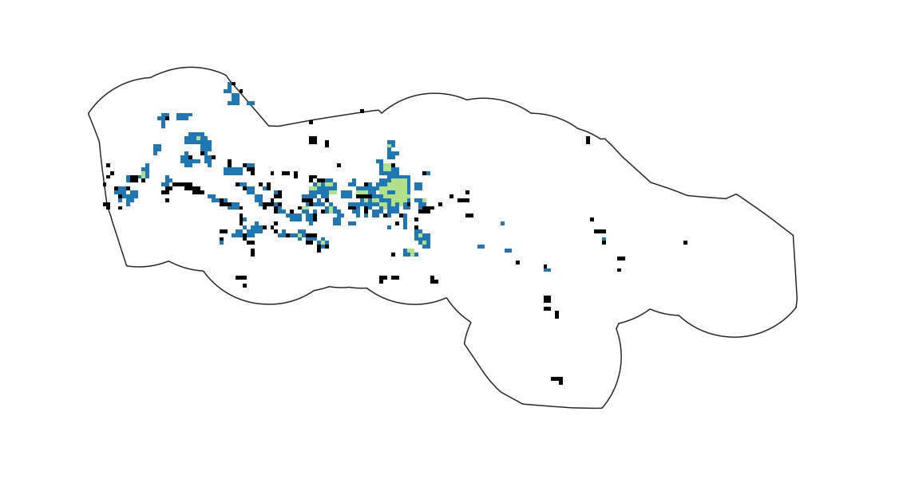

### Import Data

First, we'll import the datasets. There are three binary rasters, each has cells with a value of zero or one. Where there is a one value, the species is predicted to be present.

Import the datasets as follow:

Black Coral:

```bash
npm run import:data

? Type of data?
Raster

? Enter path to src file (with filename)
data/src/blackcoral.tif

? Choose unique datasource name (a-z, A-Z, 0-9, -, _), defaults to filename
blackcoral

? Select raster band to import
1

? What type of measurement is used for this raster data?
Quantitative - cell value (number) represents a measurement of a single thing
```

Cold Water Coral:

```bash
npm run import:data

? Type of data?
Raster

? Enter path to src file (with filename)
data/src/coldwatercoral.tif

? Choose unique datasource name (a-z, A-Z, 0-9, -, _), defaults to filename
coldwatercoral

? Select raster band to import
1

? What type of measurement is used for this raster data?
Quantitative - cell value (number) represents a measurement of a single thing
```

Octocoral:

```bash
npm run import:data

? Type of data?
Raster

? Enter path to src file (with filename)
data/src/octocoral.tif

? Choose unique datasource name (a-z, A-Z, 0-9, -, _), defaults to filename
octocoral

? Select raster band to import
1

? What type of measurement is used for this raster data?
Quantitative - cell value (number) represents a measurement of a single thing
```

### Precalc

Now precalculate metrics for the raster.

```typescript
npm run precalc:data

? Do you want to precalculate only a subset?
Yes, by datasource

? Which datasources do you want to precalculate? (will precalculate for all geographies)
Let me choose

? What datasources would you like to precalculate? (select as many as you want)
blackcoral - raster
coldwatercoral - raster
octocoral - raster

3 datasource/geography combinations precalculated successfully
```

### Add Metric Group

Now define a metric group in `project/metrics.json` consisting of three classes, one for each type of coral, each pointing to the appropriate datasource at the class level:

```json
{
  "metricId": "coralspecies",
  "classes": [
    {
      "datasourceId": "blackcoral",
      "classId": "blackcoral",
      "display": "Black Coral",
      "objectiveId": "blackcoral"
    },
    {
      "datasourceId": "coldwatercoral",
      "classId": "coldwatercoral",
      "display": "Cold Water Corals",
      "objectiveId": "coldwatercoral"
    },
    {
      "datasourceId": "octocoral",
      "classId": "Octocoral",
      "display": "Octocoral",
      "objectiveId": "octocoral"
    }
  ]
}
```

### Add Objective

Open `project/objectives.json` and add an objective for each data class:

```json
  {
    "objectiveId": "blackcoral",
    "shortDesc": "Black Coral 15%",
    "target": 0.15,
    "countsToward": {}
  },
  {
    "objectiveId": "coldwatercoral",
    "shortDesc": "Cold Water Coral 25%",
    "target": 0.25,
    "countsToward": {}
  },
  {
    "objectiveId": "octocoral",
    "shortDesc": "Octocoral 35%",
    "target": 0.35,
    "countsToward": {}
  }
```

### Create Report

Now create the report

```text
npm run create:report

? Type of report to create
Raster overlap report - calculates sketch overlap with raster datasources

? Describe what this reports geoprocessing function will calculate (e.g. Calculate sketch overlap with boundary polygons)
Calculate sketch overlap with coral species

? Select the metric group to report on
coralspecies

? Type of raster data
Quantitative - Continuous variable across the raster

? Statistic to calculate
sum - sum of value of valid cells overlapping with sketch

✔ Created coralspecies report
✔ Registered report assets in project/geoprocessing.json
```

### Add To Tab Report

Next, add CoralspeciesCard to the **Biological** page in TabReport. Open `src/clients/TabReport.tsx` and insert the following at the appropriate places:

<details>
<summary>src/clients/TabReport.tsx</summary>

```jsx
import { CoralspeciesCard } from "../components/CoralspeciesCard.js";

<ReportPage hidden={tab !== "BIOLOGICAL"}>
  <CoralReefCard />
  <CoralspeciesCard />
</ReportPage>;
```

</details>

Storybook should update on save and display the following:

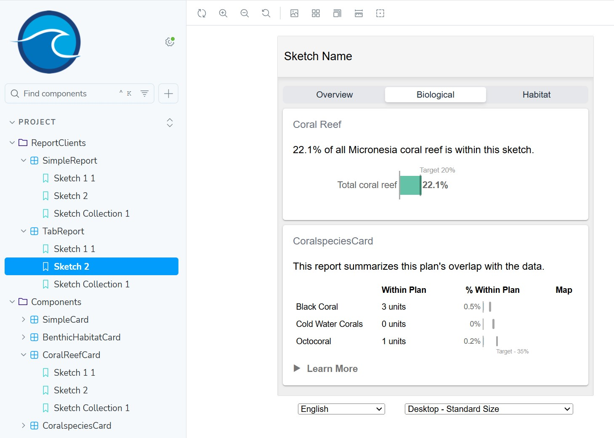

### Language Translation

To support more languages than just English, start with extracting all of the latest strings from your reports:

```bash
npm run extract:translation
```

You will want to then look at the git changes produced in `src/i18n/lang/en/translation.json` and make adjustments to your reports until the extract strings look right.

To learn more visit the
[LINK TO TRANSLATION DOC]

## Create Github Project

At this point, you can push your code from your local git repository to a remote repository on Github. First, [create a remote Github repository](https://github.com/new) called `fsm-reports-test`. Leave it empty, do not choose to initialize with a template, README, gitignore, or LICENSE.

```bash
git remote add origin https://github.com/PUT_YOUR_GITHUB_ORG_OR_USERNAME_HERE/fsm-reports-test.git
git push -u origin main
```

You should see your files successfuly pushed to Github.

It may ask you if it can use the Github extension to sign you in using Github. It will open a browser tab and communicate with the Github website. If you are already logged in there, then it should be done quickly, otherwise it may have you login to Github.

## What's Next

You've now completed the sample tutorial. Next steps include:

- Further customize these reports to suit your needs. Look at the storybook [component libary](/storybook) to see what is available.
- [Create a new project](./newproject.md), deploy it to a production environment, publish your data, and integrate your reports with SeaSketch.
- [Setup an existing project](./existingproject.md), and re-deploy it.
